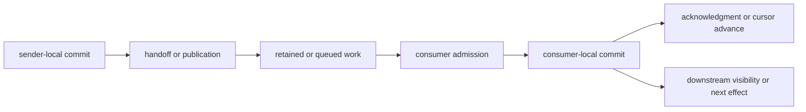

# Asynchronous Interaction Design

Asynchronous interaction design is the architecture practice of making independently progressing work explicit when one interaction is split across time, participants, and commit boundaries.

It commonly becomes important when teams adopt [[Event-Driven Architecture|event-driven architecture]], [[CQRS as Architecture Practice|CQRS]], [[Event Sourcing as Architecture Practice|event sourcing]], [[Transactional Outbox|transactional outbox]], [[Sagas|sagas]], [[Process Managers|process managers]], [[Brokers|brokers]], or stream processing. These practices often move work that was previously completed within a request into a pipeline of independently scheduled stages with distinct failure and recovery boundaries.

Asynchrony does not remove coupling. It replaces some immediate control-flow and availability coupling with protocol, capacity, history, schema, recovery, and operational coupling.

## The Architectural Shift

In a synchronous-looking interaction, a caller often waits for one response and treats that response as the operation boundary. The implementation may still be distributed and subject to partial failure, but control flow presents one bounded interval.

An asynchronous handoff exposes more of the actual occurrence structure:

Each arrow may cross a different [[Boundaries|boundary]]. Each stage can advance, pause, retry, duplicate, fail, recover, or be observed independently. The architecture must say which occurrence establishes acceptance, responsibility transfer, domain commitment, downstream visibility, and process completion.

This shift creates several obligations:

- **Completion becomes a protocol.** Enqueue, publication, broker persistence, consumer delivery, handler completion, local commit, projection visibility, and business completion are different claims. See [[Acknowledgments|acknowledgments]] and [[Commit Boundaries|commit boundaries]].
- **Partial failure becomes ordinary.** Sender, broker, consumer, store, projection, and external effects may fail independently.
- **Capacity becomes accumulated state.** Work that is accepted faster than it completes becomes backlog rather than immediate latency or rejection.
- **Time and order become explicit.** Emission, admission, processing, commit, acknowledgment, and visibility order may differ.
- **History becomes an operational dependency.** Retention, replay, checkpoints, schemas, and handler compatibility constrain recovery and new-consumer bootstrap.
- **Observation becomes multi-scale.** One API operation, one message attempt, and one long-running business process need related but different observability scopes.

## Fate Sharing and Independent Failure

[[Durability|Fate sharing]] describes which components fail or survive together; it is not a synonym for synchrony. A synchronous RPC can cross independently failing boundaries, while a durable asynchronous handoff may deliberately let queued work survive the producer or consumer.

The important architectural change is that the sender may finish after transferring a narrower responsibility while downstream work continues elsewhere. A successful sender-local commit or broker acknowledgment therefore cannot be interpreted as downstream or business completion unless an explicit protocol establishes that meaning.

Absence of progress is also ambiguous. At an interaction boundary, a consumer with no visible progress may be slow, overloaded, paused, partitioned, crashed, repeatedly retrying, blocked behind another item, or processing work whose result has not yet become visible. A timeout or lease expiry is a policy decision made under uncertainty, not proof of which condition occurred. This is the [[Safety and Liveness|safety and liveness]] tension of asynchronous systems in operational form.

Deadlines and cancellation no longer propagate automatically through a call stack. They must become explicit protocol data or process transitions, with clear meanings for work that has already committed or produced irreversible [[Effects|effects]].

## Flow Health and Stability

Error rate alone is not a health model for an asynchronous stage. A stage can process every item successfully and still be capacity-unstable because accepted work accumulates faster than it completes.

[[Queueing Theory|Queueing theory]] supplies the standard vocabulary and operational laws for relating arrival, service, throughput, accumulated work, utilization, and response time. The architecture still has to declare the semantic boundary at which acceptance and completion are measured.

The following terms should be kept distinct and measured at a declared consumer, partition, subscription, tenant, process, or projection boundary:

| Term                         | Boundary-relative meaning                                                                                                                                        |
| ---------------------------- | ---------------------------------------------------------------------------------------------------------------------------------------------------------------- |
| offered or emission rate     | work produced or offered to the stage before admission, rejection, shedding, or loss                                                                             |
| accepted arrival rate        | work admitted into the stage per unit time                                                                                                                       |
| sustainable service capacity | the rate the stage can sustain under the stated workload and dependencies                                                                                        |
| completion or departure rate | work reaching the stage's declared completion boundary per unit time                                                                                             |
| backlog                      | accepted work that has not reached that completion boundary, including queued, delayed, retrying, in-flight, or blocked work when the measurement can observe it |
| queue depth                  | work physically present in one queue; often only one component of total backlog                                                                                  |
| position lag                 | distance between produced and consumed or committed positions within one ordering space, such as records or offsets                                              |
| time or freshness lag        | elapsed time from a declared source occurrence or admission point to processing or visibility                                                                    |
| oldest-work age              | time the oldest incomplete item has waited since a declared occurrence or admission point                                                                        |
| completion latency           | end-to-end time from acceptance to the declared semantic completion boundary                                                                                     |

Counts are not interchangeable with time. Ten expensive records may represent more work than ten thousand cheap records. Position lag is meaningful only within the same stream or ordering space. Average lag can hide a stuck partition, hot key, tenant, or priority class.

For backlog $B$, admitted arrival rate $\lambda$, and sustainable effective service capacity $\mu$, a rough catch-up estimate is:

$$
T_{\text{catch-up}} \approx \frac{B}{\mu - \lambda}, \qquad \mu > \lambda
$$

If $\mu \leq \lambda$, there is no finite catch-up time while arrivals continue at that rate. The design must reduce admission, shed or defer work, add effective capacity, remove a bottleneck, or change the topology. Infinite buffering postpones visible failure; it does not restore stability.

Under stable steady-state conditions and consistent boundary definitions, Little's Law relates mean jobs in the system $L$, throughput $X$, and mean response time $R$:

$$
L = XR
$$

For an asynchronous stage, backlog $B$ can play the role of $L$ only when it counts exactly the jobs inside the boundary used to measure $X$ and $R$. This is a diagnostic relationship, not a liveness guarantee. Bursts, retries, non-uniform work, partitions, and changing capacity still require distribution- and horizon-aware measurements.

Useful flow health usually combines backlog, oldest-work age, arrival and completion rates, retry rate, saturation, end-to-end completion or freshness latency, quarantine count, and loss or expiry. Metrics should be reported both end-to-end and per stage so that a healthy aggregate does not hide a blocked lane.

[[Interaction|Backpressure and flow control]] communicate capacity through the interaction graph. [[Rate Limiting|Rate limiting]], admission control, bounded buffers, quotas, batching, concurrency limits, priority, and load shedding decide how the system responds. Fanout and retry can amplify one accepted input into many units of downstream work, so capacity planning must use effective work rather than only producer message count.

## Ordering, Time, and Scheduling

Asynchronous pipelines contain several non-identical orders: source-event order, publication order, partition order, delivery order, scheduler-selection order, handler-completion order, commit order, cursor order, and visibility order. [[Ordering|Ordering]] guarantees must name the key, stream, partition, entity, process, or other ordering space to which they apply.

Ordering narrows parallelism. A stalled item causes **head-of-line blocking** only within the lane whose later work is not allowed to pass it. Skipping, quarantining, repartitioning, or processing around the item may restore progress but changes the ordering or completion claim and therefore requires an explicit rule.

Partitioning introduces hot keys, skew, assignment changes, and rebalancing pauses. Aggregate consumer capacity may look sufficient while one ordering lane grows without bound. [[Scheduling|Scheduling]] and [[Fairness|fairness]] determine whether retries, backfills, large tenants, low-priority work, or maintenance tasks can starve live work.

Stream processing may also distinguish event time, ingestion time, processing time, and visibility time. Late or out-of-order records, windows, and watermarks are policies for reasoning about incomplete time-bounded input; a watermark is an operational claim about expected future lateness, not proof that no earlier event can arrive.

## Failure, Retry, and Quarantine

Failures need classification relative to an attempt and boundary:

- A **transient failure** is expected to become retryable under a changed short-term condition.
- A **persistent failure** continues until code, data, configuration, schema, authority, or a dependency changes.
- A **poison item** is an item that repeatedly prevents useful processing under the current handler and policy. Poison is not necessarily an intrinsic property of the data; a deployment or dependency change may alter the classification.
- An **ambiguous outcome** means the observer cannot determine whether another boundary committed the work.
- A **terminal business failure** is a modeled process outcome, not merely an exhausted infrastructure retry budget.

[[Retry|Retries]] consume capacity and create feedback. They need budgets, backoff, jitter, idempotency, and a rule for distinguishing another useful attempt from load amplification. Retry storms can reduce service capacity precisely when the original failure is caused by overload.

A dead-letter queue is better understood as a **quarantine path**. It removes obstructing work from a live delivery lane after a declared policy, but it does not complete, repair, or semantically reject that work. A viable quarantine path needs ownership, alerting, failure context, retention, access controls, replay or repair tooling, and a reconciliation rule for effects that may already have committed.

Acknowledgment timing determines the duplicate-versus-loss tradeoff. A consumer that acknowledges before its local commit can lose work; one that commits before acknowledging can receive duplicates after a crash. [[Transactional Inbox|Transactional inbox]], idempotent transitions, and atomic offset-plus-state mechanisms are ways to narrow that gap. Any “exactly once” claim must name its boundary and does not automatically cover external non-idempotent effects.

## Retention, Durability, and Replay

[[Durability]] and retention answer different questions. Durability specifies the failure boundaries across which recorded material is expected to remain available, reconstructable, or authoritative. Retention states how long or under what policy that material remains available. A message can be durable across worker and broker restart yet expire tomorrow because it crossed a retention horizon.

Retention is therefore part of the recovery contract. It must cover the intended outage, detection, repair, and catch-up horizon, or another authoritative source, snapshot, or reconciliation mechanism must fill the gap. Consumer offsets, deduplication records, idempotency keys, encryption keys, schemas, and handler versions have related lifetimes; preserving a message without preserving what is needed to interpret and safely apply it is not sufficient replayability.

Compaction is also not equivalent to full retention. A compacted history may reconstruct selected current state while omitting intermediate events needed for audit, process recovery, temporal queries, or a different future projection.

In [[Event Sourcing|event sourcing]], the authoritative committed event history should be distinguished from a broker's distribution log. A broker may retain a shorter delivery window while the event store preserves the domain history, but recovery then needs a reliable way to resume publication or consumption from that authoritative history. Event sourcing by itself does not supply consumer groups, fanout, independent cursors, or replay isolation.

## Consumer Bootstrap, Backfill, and Cutover

A new or repaired consumer may need historical state before it can process live changes correctly. The bootstrap protocol should identify:

- The authoritative source and history or snapshot available to the consumer.
- A source position, version, or [[Consistent Cuts|consistent cut]] to which the initial state corresponds.
- How changes after that position are buffered, replayed, or consumed without an unaccounted gap.
- How duplicates around the cutover are detected or made harmless.
- Which schema, policy, and handler versions interpret historical records.
- How correctness and completeness are validated before the consumer is declared current.

**Live processing** and **backfill** are distinct operating modes. Live processing optimizes bounded freshness under ongoing arrivals. Backfill, rebuild, or replay processes a finite historical range, often as quickly as safely possible. They may share semantic transformation logic, but they need separate execution controls for capacity, priority, checkpoints, restart, observability, and side effects.

A backfill must not accidentally repeat notifications, payments, commands, or other external effects merely because it replays facts used to build a projection. It needs an explicit effect policy. It should also avoid starving live traffic, overtaking it incoherently, or invalidating the position used for cutover. Resource isolation, rate budgets, checkpointed progress, high-water marks, shadow outputs, validation, and reconciliation are common controls.

## Interaction Topology

Topology should be described independently from product or protocol names:

| Interaction shape | Consumption and ownership | History and replay | Characteristic concerns |
| --- | --- | --- | --- |
| work queue or mailbox | one item is claimed by one effective consumer or serialized receiver | often removed or hidden after acknowledgment; replay depends on broker policy | work distribution, acknowledgment gaps, poison items, head-of-line blocking |
| routed pub/sub | routing creates one or more subscription or queue copies; consumers may compete within each copy | retention and replay are subscription-specific | fanout amplification, route evolution, per-subscriber backlog and failure |
| retained log or stream | records remain in ordered partitions while consumers own cursors or offsets | replay is native only within retention and compaction rules | partition ordering, lag, cursor durability, rebalancing, backfill, hot keys |

AMQP is a protocol family, not one topology. An AMQP-based broker can realize routed queues, pub/sub, competing consumers, or other arrangements depending on exchanges, addresses, queues, subscriptions, and routing rules. Likewise, “topic,” “queue,” and “stream” are not enough to infer delivery cardinality, ordering, cursor ownership, retention, or replay.

Point-to-point should likewise name its addressing and consumption meaning. It may mean one fixed receiver or one effective receiver selected from a competing group. In either case, each delivery has one intended recipient, unlike fanout where distinct subscriptions receive their own copies.

The architecture should state:

- Producer-to-consumer cardinality and whether each consumer receives a copy or competes for shared work.
- Partitioning, routing, ordering, and affinity keys.
- Who owns and durably advances the cursor, claim, or acknowledgment.
- How slow consumers affect producers, other consumers, and retained storage.
- How topology changes, rebalances, resharding, and consumer deployment affect progress.

## Observability across Asynchronous Time

Asynchronous systems need at least three related observation scopes:

1. **Operation trace:** one bounded API operation, handler activation, or processing attempt, including its local commit and handoff result.
2. **Causal message links:** the emission, delivery, retry, and consumption relations among operations. Correlation alone groups records; a causation link makes a stronger claim about which occurrence produced another.
3. **Process or flow history:** the durable, potentially long-running view of one business [[Process|process]] across many API operations, messages, timers, compensations, and human steps.

One arbitrarily long distributed trace is usually the wrong sole representation for a long-running process. A process identity, process state or history, [[Process Graphs|process graph]], and [[Flow Views|flow view]] should explain durable cross-operation progress, while bounded traces explain individual executions and causal links connect them.

Useful context may include operation, message, causation, process, subject, and idempotency identities; source version or position; partition and consumer; attempt number; handler or schema version; acknowledgment and commit points; and the reason for retry, skip, quarantine, or compensation. These are different identities and should not be collapsed into one correlation identifier.

Telemetry tracing is also distinct from the categorical idea in [[Trace and Feedback|trace and feedback]]. The latter models outputs becoming later inputs; observability traces record evidence about executions. Feedback loops still matter operationally because retries, fanout, projection-triggered commands, and backpressure can stabilize or amplify the system.

## Schema and Semantic Evolution

Independent deployment means producers, stored histories, consumers, and replay code may run or represent different versions at the same time. [[Shape|Schema or shape]] compatibility is necessary but not sufficient: a payload can remain structurally readable while changing its units, defaults, authority, interpretation, or business meaning.

The evolution contract should cover forward and backward structural compatibility, semantic compatibility, unknown record types, defaulting, versioned transformation, and the replay horizon. A consumer that can process today's live records but cannot interpret retained history is not rebuildable for the claimed horizon.

Long-lived retained data also creates governance obligations: access control, tenant isolation, encryption, redaction, deletion, legal retention, and audit rules must apply to queues, logs, quarantine stores, snapshots, and backups, not only to primary databases.

## Relation to Adjacent Practices

[[Weak Isolation Patterns|Weak isolation patterns]], more precisely patterns for consistency beyond transaction boundaries, focus on preserving invariants and useful correctness after one atomic isolation or commit boundary is lost. Asynchronous interaction design is broader on the liveness and operating side: capacity, lag, failure detection, retention, replay, topology, observability, evolution, and operator control. The concerns overlap at acknowledgment, ordering, idempotency, retry, recovery, pending states, and completion semantics.

[[Event-Driven Architecture|Event-driven architecture]] organizes interaction among independent participants around the publication and observation of events. The operational concerns described here also apply to asynchronous commands, jobs, actor messages, projection updates, and deferred requests, regardless of whether they carry domain events.

With [[CQRS as Architecture Practice|CQRS]], a command-side transition may commit before the corresponding read models are updated. The relevant completion and freshness measures are projection-specific: command commitment, projection position, read visibility, and read-your-writes are different claims.

[[Event Sourcing as Architecture Practice|Event sourcing]] makes committed event history authoritative. It does not by itself determine the topology, delivery, retention, replay isolation, or operating model of downstream consumption.

[[Transactional Outbox|Transactional outbox]] makes publication responsibility durable with a local commit. It does not ensure prompt relay, broker retention, consumer progress, or business completion; the outbox relay itself has backlog, lag, ordering, acknowledgment, and recovery obligations.

[[Sagas|Sagas]] and [[Process Managers|process managers]] give long-running work identity, state, decisions, timeouts, compensation, and completion meanings. Their process history is the natural cross-operation view when one request trace is too narrow.

Stream processing adds continuous dataflow, partitioned state, event-time policies, windows, watermarks, checkpointing, and stateful recovery. These are specialized realizations of the same asynchronous concerns and should not be inferred merely from the presence of a broker or event schema.

## Design Checks

For every asynchronous edge or stage, ask:

- What semantic role crosses the edge: [[Command|command]], [[Event|event]], [[Observation|observation]], signal, acknowledgment, or execution work?
- Which occurrence means accepted, durable, committed, visible, completed, failed, cancelled, expired, or quarantined?
- Where is responsibility held before, during, and after handoff?
- What are the arrival rate, sustainable capacity, backlog, oldest-work age, lag, and catch-up objective at both aggregate and partitioned scopes?
- How do backpressure, admission, rate limits, priority, fairness, and load shedding respond to overload?
- What ordering and time relations are required, and what parallelism do they constrain?
- What happens for duplicate, late, missing, malformed, poison, and ambiguously completed work?
- Which acknowledgments and cursors are atomic with which local effects?
- How long are messages, histories, snapshots, offsets, deduplication records, schemas, and replay code retained?
- How does a new consumer bootstrap and move from backfill to live processing without an unexplained gap or duplicate effect?
- What topology provides fanout, competition, cursor ownership, retention, replay, and slow-consumer isolation?
- How are one operation, one causal chain, and one long-running process observed and correlated?
- Which operator actions exist to pause, drain, inspect, quarantine, repair, replay, skip, reset, reshard, reconcile, and resume work?
- Which data-governance and security rules apply to retained and quarantined copies?

## Failure Modes

The practice fails when enqueue acknowledgment is presented as business completion, when error rate is monitored without backlog and oldest-work age, when unbounded buffers hide instability, when aggregate lag hides a blocked partition, or when retry amplifies an overloaded dependency.

It also fails when a dead-letter queue has no owner or repair path, when retention is shorter than the recovery horizon, when a new consumer has no coherent bootstrap protocol, when backfill competes blindly with live traffic or repeats external effects, when “exactly once” is claimed without a boundary, when a protocol name is mistaken for a topology, or when one transient trace is expected to explain an arbitrarily long business process.

Related concepts: [[Queueing Theory|queueing theory]], [[Synchrony and Asynchrony|synchrony and asynchrony]], [[Interaction|interaction]], [[Safety and Liveness|safety and liveness]], [[Scheduling|scheduling]], [[Fairness|fairness]], [[Rate Limiting|rate limiting]], [[Delivery Semantics|delivery semantics]], [[Acknowledgments|acknowledgments]], [[Commit Boundaries|commit boundaries]], [[Durability|durability]], [[Ordering|ordering]], [[Idempotency|idempotency]], [[Retry|retry]], [[Recovery|recovery]], [[Distributed Failure Scenarios|distributed failure scenarios]], [[Weak Isolation Patterns|weak isolation patterns]], [[Event-Driven Architecture|event-driven architecture]], [[CQRS as Architecture Practice|CQRS]], [[Event Sourcing as Architecture Practice|event sourcing]], [[Transactional Outbox|transactional outbox]], [[Transactional Inbox|transactional inbox]], [[Sagas|sagas]], [[Process Managers|process managers]], [[Process Graphs|process graphs]], [[Flow Views|flow views]], [[Brokers|brokers]], [[Event Sourcing|event sourcing substrate]], [[CQRS|CQRS substrate]], [[Outbox|outbox substrate]], [[Trace and Feedback|trace and feedback]].
