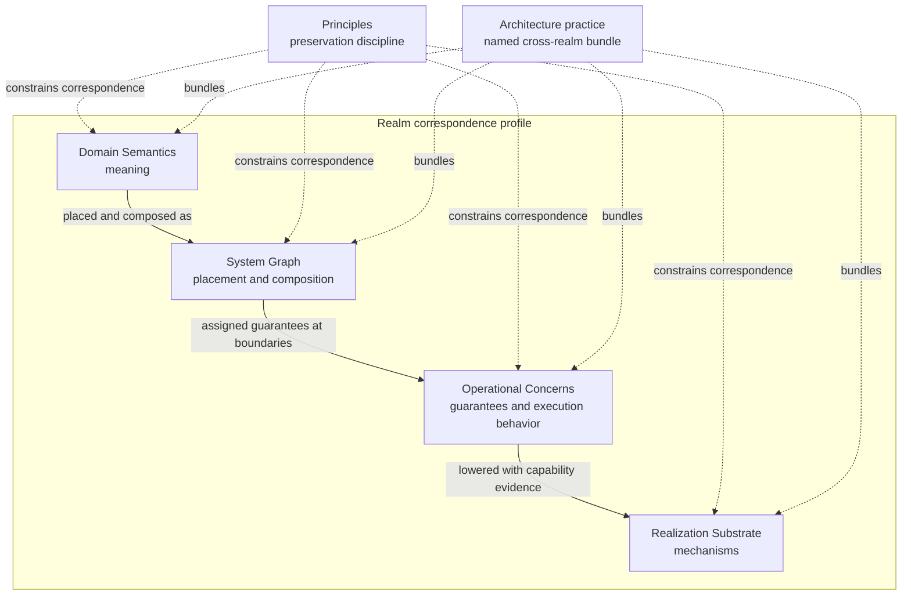
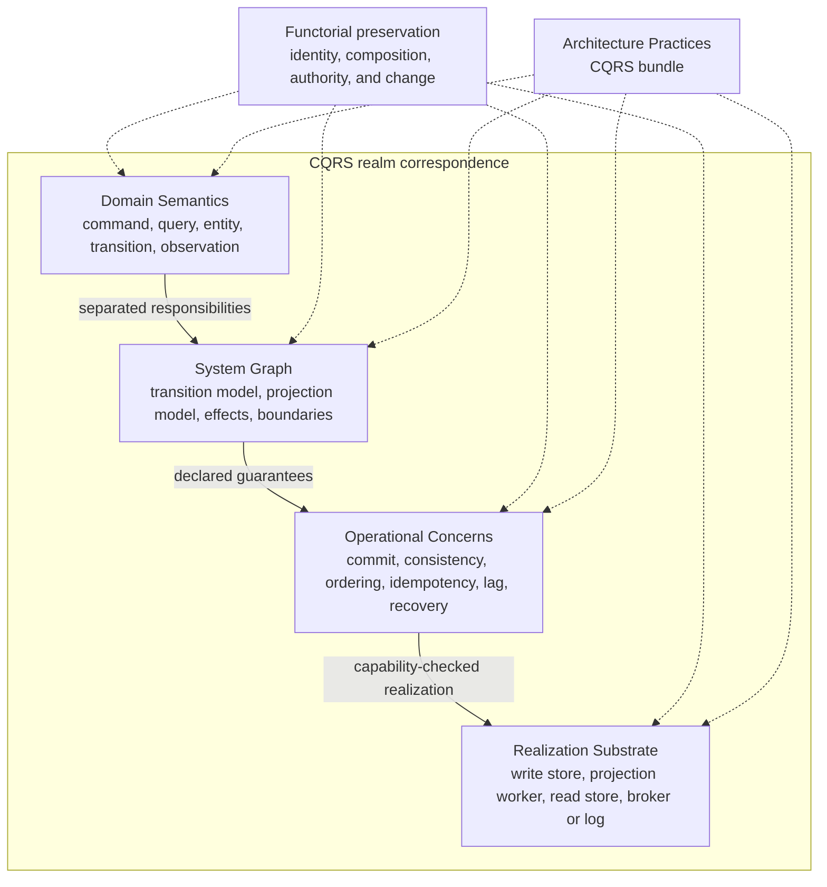

# Pattern Languages and Correspondence

Pattern languages and catalogs preserve experience about recurring problems, forces, arrangements, and consequences. Cohesive reconciles them by placing each imported pattern into the realms where its claims belong and recording the correspondences among those claims.

A source pattern is not automatically a new Cohesive primitive. It may name a semantic structure, a system-graph arrangement, an operational concern, a realization mechanism, or an [[Architecture Practices|architecture-practice]] bundle spanning several realms. Two catalogs may also use the same word for different roles or different words for corresponding roles.

This framework lets Cohesive connect [[Domain-Driven Design|domain-driven design]], [[Analysis Patterns|analysis patterns]], [[Patterns of Enterprise Application Architecture|enterprise application patterns]], [[Enterprise Integration Patterns|enterprise integration patterns]], [[Workflow Patterns|workflow patterns]], the [[Microservice Pattern Language|microservice pattern language]], [[Patterns of Distributed Systems|distributed-systems patterns]], and [[Pattern-Oriented Software Architecture|POSA]] without flattening their distinctions.

## The Realm Lens

Each realm asks a different question of a pattern:

| Realm | Question asked of the pattern |
| --- | --- |
| Principles | Which distinctions, compositions, and preservation rules make the correspondence coherent? |
| Domain Semantics | What does the pattern mean for entities, values, observations, events, commands, transitions, processes, policies, invariants, authority, and boundaries? |
| System Graph | How are those meanings placed, connected, scoped, composed, routed, projected, or coordinated in a modeled system? |
| Operational Concerns | Which guarantees and execution behaviors are required under concurrency, time, failure, load, recovery, and change? |
| Realization Substrate | Which runtimes, stores, brokers, protocols, schedulers, hosts, logs, or other mechanisms can realize those requirements? |
| Architecture Practices | Which recurring problem and forces cause several choices from the other realms to be adopted as one named bundle? |

Architecture practices are therefore not an additional lowering stage between meaning and mechanics. They are named bundles whose realm profile may touch any of the other realms.

## Cross-realm correspondence

In plain language, a correspondence should preserve the relationships that make the source pattern useful:

- Distinct identities do not silently become the same identity.
- A composed source operation corresponds to a coherent composition in the target.
- Doing nothing at the source does not introduce an unexplained target change.
- Changes, observations, dependencies, and effects remain attributable across boundaries.
- Domain authority does not move merely because a mechanism routes, stores, schedules, or replicates data.
- Ordering, failure, completion, and consistency claims remain scoped to the boundary that can establish them.
- Information that is forgotten, approximated, delayed, aggregated, or newly introduced is declared.

Many useful correspondences are partial, one-to-many, or relational rather than total functions. One semantic process may have several workflow realizations; one message channel may carry several semantic roles; one catalog pattern may decompose into several Cohesive nodes. The framework is called functorial because it demands structure-preserving correspondence, not because every crosswalk must be formalized as one mathematical functor.

### Nominal realm peers

An established term or named pattern sometimes needs more than one graph entry because its claims have different primary roles in different realms. Those entries are **nominal realm peers**: distinct, realm-specific treatments of the same named notion. For example, an architecture-practice entry can own the problem, forces, and cross-realm bundle while a realization-substrate entry with the same nominal subject owns a technical mechanism family.

The formal relation `realm_peer_of` records this case. It is symmetric, must connect different realms, and is authored once as a normal wikilink in a formal-relations section. Prefer to author it from the entry whose title is explicitly realm-qualified; the derived inverse makes the peer visible from both entries and allows projections to surface peers as navigation metadata.

Nominal peerhood does not make the entries equal, interchangeable, or jointly authoritative. It also does not assert that one entry realizes the other. Each peer retains its own realm, kind, scope, and guarantees, and the relation rationale should summarize that division. Use a directed predicate such as `bundles`, `qualifies`, or `may_realize` for those stronger claims, and use `corresponds_to` for a structural correspondence between differently named notions.

## Cross-Realm Category Errors

Much of the recurring confusion around systems patterns comes from **cross-realm category errors**: a semantic construct, system-graph structure, operational property, architecture practice, or realization mechanism is treated as though it were an object or claim of another realm. The problem is not crossing realms. Patterns must cross realms to become useful systems. The error is collapsing the realms without naming the correspondence, its boundary, and what it preserves.

In Cohesive, **realm collapse** is the shorter name for this failure mode. The term avoids suggesting that every such mistake is a formal error in category theory. It identifies an unexamined change in descriptive perspective: a carrier becomes the meaning it carries, a mechanism becomes the role it realizes, a local guarantee becomes an end-to-end outcome, or a projection becomes an authoritative source.

Common forms include:

| Realm collapse | Representative mistaken claim | Missing distinction |
| --- | --- | --- |
| Realization mechanism becomes semantic meaning. | "The actor is the entity." | An actor may [[Realization\|realize]] an entity observer without being identical to the [[Entity\|entity]]. |
| Carrier becomes interpreted role. | "This broker record is a domain event" or "this HTTP request is a command." | A message carries evidence; an observer assigns boundary-relative [[Event\|event]] or [[Command\|command]] meaning. |
| Graph structure becomes an operational guarantee. | "The queue decouples the systems." | A channel arrangement does not establish capacity, time, delivery, failure, or responsibility-transfer properties by itself. |
| Local guarantee becomes an end-to-end result. | "The broker acknowledged the message, so the business operation completed." | [[Acknowledgments\|Acknowledgment]] meaning and [[Commit Boundaries\|commit boundaries]] remain scoped to the observer and mechanism that can establish them. |
| Runtime execution becomes semantic process. | "The workflow execution is the business process." | A workflow engine may execute or recover a [[Process\|process]] without defining its purpose, authority, participants, or completion meaning. |
| Projection becomes authority. | "The read model is the entity's state." | A [[Projection Models\|projection model]] derives observations; derivation does not silently transfer semantic authority. |
| Similarly named operational and semantic properties become identical. | "Exactly-once delivery gives exactly one domain effect." | A single semantic discharge may require stable identity, deduplication, serialized commitment, and recovery rather than a same-named transport guarantee. |

Pattern names are especially susceptible because a pattern often bundles semantic intent, graph arrangement, operational obligations, and realization guidance under one convenient label. Its name can be used across several communities and abstraction levels even when the underlying claims differ. A realm signature makes that variation reviewable instead of forcing one interpretation to stand for the whole pattern.

Every cross-realm claim should therefore name the relation being asserted, such as **carries**, **arranges**, **constrains**, **requires**, **realizes**, **preserves**, **approximates**, or **forgets**. It should also state the boundary at which the relation holds and the structure or properties that survive it. Similar names, adjacency in a diagram, or common implementation practice are not by themselves evidence of correspondence.

## Reusable Realm Correspondence Profile

Every catalog entry adopted into the graph should record:

1. **Source identity and provenance**: catalog, canonical name, authors, and source reference.
2. **Problem and forces**: the recurring situation and tradeoffs the pattern addresses.
3. **Realm signature**: primary, supporting, and incidental realms.
4. **Semantic trace**: the domain meanings assumed, carried, or constrained.
5. **System-graph trace**: the boundaries, nodes, edges, flows, scopes, and compositions introduced.
6. **Operational obligations**: correctness, delivery, time, ordering, capacity, recovery, compatibility, and security requirements.
7. **Realization choices**: possible mechanisms without making one mechanism canonical meaning.
8. **Preservation conditions**: what must remain true as the pattern is projected, translated, or lowered.
9. **Declared loss and introduction**: information forgotten or mechanics added by the mapping.
10. **Non-correspondences**: similarly named concepts that must not be identified.
11. **Catalog relations**: equivalent, refining, overlapping, or composing patterns from other sources.

## Visualization Grammar

The reusable visualization places semantic meaning, graph structure, operational guarantees, and realization mechanics on one correspondence path. Principles constrain every mapping, while the architecture-practice node names the bundle spanning them.

Solid arrows denote correspondence or lowering. Dotted arrows denote a cross-cutting preservation rule or bundle membership. A catalog entry can emphasize only part of the profile, but a missing realm should be interpreted as out of scope rather than assumed to be satisfied.

## CQRS as a Realm-Spanning Bundle

[[CQRS as Architecture Practice|CQRS]] illustrates the complete profile:

The profile prevents CQRS from collapsing into two databases or a messaging topology:

| Realm | CQRS correspondence |
| --- | --- |
| Domain Semantics | Commands request interpreted change; queries request observations; entities, transitions, invariants, policies, and authority determine valid writes. |
| System Graph | Transition models own write decisions; projection models derive queryable observations; effects and boundaries connect the sides. |
| Operational Concerns | Commit meaning, projection lag, consistency, ordering, idempotency, read-your-writes, compatibility, and rebuild recovery are explicit. |
| Realization Substrate | Current-state stores, event histories, brokers, logs, projection workers, indexes, caches, and read stores are replaceable realization families. |
| Architecture Practices | CQRS names the deliberate bundle and its forces; it does not make any one topology mandatory. |

The correspondence is preserved when a committed command-side version maps to identifiable projection input, projection progress maps to a declared source position, and query observations retain their source and freshness meaning. It is broken when command success is reported as universal read visibility, when a read-model identifier silently replaces entity identity, or when an implementation queue becomes the semantic definition of the split.

## Comparative Realm Signatures

The same profile scales from small patterns to broad bundles:

| Pattern or bundle | Primary realm span | Key preservation test |
| --- | --- | --- |
| DDD Aggregate | Domain Semantics, System Graph, Operational Concerns | Preserve entity identity, invariant scope, transition authority, and commit boundary; do not identify the aggregate with one object graph or database transaction. |
| Repository | System Graph, Architecture Practices, Operational Concerns, Realization Substrate | Preserve domain identity, query meaning, freshness, authority, and unit-of-work behavior across the storage correspondence. |
| EIP Command Message | System Graph, Operational Concerns, Realization Substrate, with a semantic trace | Preserve contract, intended observer, command evidence, correlation, and ingress occurrence without making transport structure the command interpretation itself. |
| Workflow Exclusive Choice | System Graph and Operational Concerns, with a semantic policy trace | Preserve branch alternatives and selection evidence while leaving domain authority with the policy or observer entitled to decide. |
| Saga | Domain Semantics, System Graph, Operational Concerns, Architecture Practices, Realization Substrate | Preserve process identity, completed effects, pending obligations, compensation meaning, and recovery state; do not reduce business recovery to retry or storage rollback. |
| Replicated Log | Operational Concerns and Realization Substrate | Preserve the declared ordering, agreement, durability, and recovery boundary without claiming that log entries are domain events. |
| POSA Reactor | System Graph, Operational Concerns, Realization Substrate | Preserve readiness observation, demultiplexing, dispatch, and scheduling behavior without identifying the reactor with the semantic observers it activates. |
| CQRS | All realms as a named architecture-practice bundle | Preserve command authority, authoritative source positions, projection derivation, freshness evidence, and query-observation meaning across replaceable mechanisms. |

## Catalog Centers of Gravity

The catalogs emphasize different parts of the same landscape:

| Catalog | Center of gravity | Cohesive reconciliation |
| --- | --- | --- |
| [[Analysis Patterns]] | Domain Semantics and System Graph | Distill reusable domain structures without treating one object model as universal ontology or implementation. |
| [[Domain-Driven Design]] | Domain Semantics, boundaries, and Architecture Practices | Establish language, ownership, invariants, authority, and model boundaries before selecting integration or deployment mechanics. |
| [[Patterns of Enterprise Application Architecture]] | Architecture Practices, System Graph, and Realization Substrate | Separate domain logic, application boundaries, persistence mapping, presentation, distribution, and concurrency mechanisms. |
| [[Enterprise Integration Patterns]] | System Graph, Operational Concerns, and Realization Substrate | Describe messages, channels, endpoints, routing, transformation, management, and interaction-control arrangements whose semantic roles remain boundary-relative. |
| [[Workflow Patterns]] | System Graph and Operational Concerns | Describe process-language capabilities such as branching, joining, data flow, resource assignment, and exception handling without defining the domain purpose of the process. |
| [[Microservice Pattern Language]] | Architecture Practices, System Graph, Operational Concerns, and Realization Substrate | Relate semantic ownership and service boundaries to distributed collaboration, data management, deployment, observability, and recovery. |
| [[Patterns of Distributed Systems]] | Operational Concerns and Realization Substrate | Explain clocks, logs, replication, quorums, partitions, leases, and interaction mechanics that establish scoped guarantees rather than domain meaning. |
| [[Pattern-Oriented Software Architecture]] | System Graph, Architecture Practices, and Realization Substrate | Supply architectural, concurrency, networking, interaction, and runtime structures across several abstraction levels. |

These are tendencies, not exclusive classifications. A pattern's actual realm signature is determined by its claims, not by the catalog containing it.

## Reconciling DDD and EIP

DDD and EIP approach a boundary from complementary directions. DDD begins with semantic ownership: which model gives a term meaning, which entity or process is involved, which rules govern change, and which events count as domain occurrences. EIP begins closer to interaction structure and mechanics: which message is carried, through which channel and endpoint, with which routing, correlation, transformation, delivery, and management behavior.

A disciplined reconciliation proceeds in this order:

1. Identify the DDD semantic boundary, subject, authority, transition, process, and domain vocabulary.
2. Place those meanings into entity, observer, transition, projection, process, message, channel, and effect structures in the system graph.
3. Use EIP to describe the required message construction, routing, transformation, endpoint, and management arrangements.
4. Assign delivery, ordering, idempotency, compatibility, correlation, retention, capacity, and recovery obligations.
5. Select brokers, stores, application hosts, runtimes, protocols, or file exchange as realizations.

For example, an EIP Command Message is a carrier whose contract strongly indicates command intent. Its receipt is still an exogenous [[Event|event]] at the receiving boundary, and the receiving observer still interprets the carried value as a [[Command|command]] relative to its model. An Event Message carries a reported occurrence, but message receipt and the reported domain event remain distinct occurrences. An EIP Process Manager can realize part of a semantic [[Process|process]], but the routing mechanism does not define the process purpose, authority, state, or completion meaning.

## External References

- Martin Fowler, [Patterns in Enterprise Software](https://martinfowler.com/articles/enterprisePatterns.html), 2005.
- Frank Buschmann, Kevlin Henney, and Douglas C. Schmidt, [*Pattern-Oriented Software Architecture, Volume 4: A Pattern Language for Distributed Computing*](https://www.wiley.com/en-us/Pattern-Oriented+Software+Architecture%2C+Volume+4%2C+A+Pattern+Language+for+Distributed+Computing-p-9780470065303), Wiley, 2007.

Related concepts: [[Functoriality|functoriality]], [[System Language and Realization|system language and realization]], [[Realization|realization]], [[Architecture Practices|architecture practices]], [[System Graph|system graph]], [[Process Theories|process theories]], [[Compositionality|compositionality]], [[Equivalence vs Equality|equivalence vs equality]], [[Boundaries|boundaries]], [[Authority|authority]], [[Compatibility and Evolution|compatibility and evolution]], [[Domain-Driven Design|domain-driven design]], [[Analysis Patterns|analysis patterns]], [[Patterns of Enterprise Application Architecture|enterprise application patterns]], [[Enterprise Integration Patterns|enterprise integration patterns]], [[Workflow Patterns|workflow patterns]], [[Microservice Pattern Language|microservice pattern language]], [[Patterns of Distributed Systems|distributed-systems patterns]], [[Pattern-Oriented Software Architecture|POSA]], [[CQRS as Architecture Practice|CQRS]].
