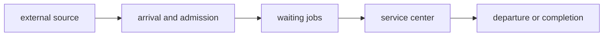

# Queueing Theory

Queueing theory is the mathematical and operational discipline for reasoning about work that arrives, waits, receives finite-capacity service, moves among resources, and completes.

The word *job* is generic. A job may be a request, message, command attempt, query, transaction, task, workflow activation, actor message, stream record, batch item, customer, packet, or physical unit. A queue may be an explicit broker queue, but it may also be implicit in a runtime executor, connection pool, storage device, lock, rate limiter, CPU run queue, service dependency, or population of callers waiting for progress.

Queueing quantities are always relative to a declared [[Boundaries|boundary]], workload class, observation interval, and completion meaning. A measurement must say what counts as arrival, admission, service, waiting, and departure. The same system can have different queueing models at an API, broker, consumer group, partition, database, process, or end-to-end boundary.

## Basic Queueing Model

A basic open queue has an external source, an admission point, waiting work, one or more servers, and a departure boundary:

Real systems add multiple job classes, routing, retries, feedback, priorities, finite buffers, timeouts, cancellation, batching, parallel service, failures, and load-dependent capacity. A queueing network composes several service centers through routing relations.

For a job $i$ at a single service center, let:

- $a_i$ be its admitted arrival time.
- $b_i$ be the time service begins.
- $c_i$ be its completion or departure time.
- $A_i = a_i-a_{i-1}$ be the inter-arrival time.
- $W_i = b_i-a_i$ be its waiting time before service.
- $S_i = c_i-b_i$ be its service time when service is contiguous.
- $R_i = c_i-a_i = W_i+S_i$ be its response, residence, or sojourn time.

Preemption, repeated visits, parallel branches, and suspended work require a more general accounting of active service and waiting intervals, but the boundary-relative distinction remains the same.

## Core Quantities

| Symbol | Quantity | Meaning |
| --- | --- | --- |
| $\lambda$ | admitted arrival rate | mean jobs admitted per unit time |
| $\bar A$ | mean inter-arrival time | mean time between admitted arrivals; under compatible stationary long-run assumptions, $\lambda=1/\bar A$ |
| $S$ | mean service time | mean time one visit occupies one server; often called processing time |
| $\mu$ | mean service rate | $\mu=1/S$ for one continuously busy server with the declared workload; it is capacity, not observed throughput |
| $X$ | throughput | mean jobs completing at the declared departure boundary per unit time |
| $W_q$ | mean waiting time | mean time waiting for service, excluding service time |
| $R$ | mean response time | mean elapsed time from admitted arrival to declared completion; $R=W_q+S$ for one non-preempted visit |
| $n(t)$ | jobs in the system | instantaneous admitted but not yet departed population, including waiting and in-service jobs |
| $L$ | mean jobs in the system | time average of $n(t)$ over the declared boundary |
| $L_q$ | mean queue length | mean jobs waiting, excluding jobs currently in service |
| $U$ | utilization | fraction of observation time for which a resource is busy, or mean fraction of parallel server capacity in use |
| $\rho$ | traffic intensity | offered work relative to capacity; in a stable lossless single-server queue, $\rho=\lambda S=\lambda/\mu$ and equals utilization |
| $V_k$ | visit ratio | mean visits to resource $k$ per system completion |
| $D_k$ | service demand | mean service at resource $k$ per system completion, $D_k=V_kS_k$ |
| $Z$ | think or delay time | mean time a closed-network job spends outside the measured service subsystem before returning |

**Processing time** is often ambiguous. For precision, use *service time* for active occupancy during one resource visit, *service demand* for total service required at a resource per system completion, and *response time* for elapsed wall-clock time including waiting.

An offered or emission rate can differ from the admitted arrival rate because work may be rejected, shed, sampled, expired, or lost before admission. Throughput can differ from both when work accumulates, fails, is cancelled, or leaves through another outcome. In a stable, lossless, flow-balanced open system, long-run admitted arrival rate and throughput coincide:

$$
\lambda = X
$$

That equality is a conclusion under stated conditions, not a definition of either rate.

## Throughput and Latency

Throughput is a rate across a completion boundary. Latency is a duration experienced by a job; queueing theory usually calls the end-to-end duration response or sojourn time.

They are related but not interchangeable:

- At low load, throughput usually follows arrival rate and response time is dominated by service time and fixed delays.
- As load approaches a bottleneck's sustainable capacity, throughput gains diminish while waiting time can grow sharply.
- Increasing concurrency can raise throughput until another resource saturates, while also increasing response time through contention, queueing, coordination, cache pressure, or larger working sets.
- A system can have acceptable average throughput and unacceptable tail latency, or low latency only because it rejects, sheds, or samples work.
- Batching can improve throughput while increasing the time an individual job waits for a batch to form.

Open systems can become unstable when admitted work persistently exceeds effective service capacity. Backlog then grows even if completed jobs report no errors. Closed systems cannot accumulate an unbounded external population, but increasing the circulating population can still drive resources to saturation and increase response time without materially increasing throughput.

Averages alone do not describe latency objectives. Percentiles, maximum tolerated age, deadline misses, and class-specific latency matter when service times are heavy-tailed, arrivals are bursty, priorities differ, or fanout makes end-to-end response depend on the slowest branch.

## Open, Closed, and Mixed Networks

An **open queueing network** receives jobs from an external arrival process and eventually releases them. The external arrival rate is an input to the model, and the number of jobs in the network varies. Stability requires that effective demand remain within capacity at every resource used by the workload.

A **closed queueing network** has a fixed population $N$ that circulates among service centers and optional delay or think centers. Its throughput is endogenous: a job that completes a cycle eventually returns, so response time and think time regulate the next effective arrival.

A **mixed network** contains open and closed workload classes. Multi-class models keep separate arrival rates, visit ratios, service demands, priorities, and response objectives when jobs place materially different demands on the same resources.

Retries and feedback complicate the classification. An externally open system can contain internal closed loops, and retry behavior can make the effective arrival rate at a dependency much larger than the external request rate. See [[Trace and Feedback|trace and feedback]].

## Service Centers and Queue Disciplines

A service center may have one server, $m$ parallel servers, a finite or infinite waiting room, and one or more job classes. It may block, reject, shed, preempt, time-slice, batch, or route work elsewhere.

The queue discipline determines which waiting job receives service next. Common disciplines include first-in first-out, last-in first-out, processor sharing, shortest-job-first, deadline order, and strict or weighted priority. The discipline affects fairness, starvation, response-time distribution, and often mean waiting time; see [[Scheduling|scheduling]] and [[Fairness|fairness]].

Kendall notation summarizes a queue as $A/S/c/K/N/D$, describing the inter-arrival distribution, service-time distribution, number of servers, capacity, calling population, and discipline. The shorter $A/S/c$ form is common. For example, $M/M/1$ denotes Markovian or Poisson arrivals, exponential service times, and one server; omitted fields usually imply conventional infinite-capacity and first-in first-out assumptions.

## Operational Laws

Operational laws are conservation relationships derived from measured counts, accumulated time, and flow balance. They require fewer distributional assumptions than stochastic queueing formulas but still require consistent boundaries, units, observation intervals, and completion definitions. They do not by themselves predict tail distributions or prove that a nonstationary system has reached steady state.

### Little's Law

For a stable boundary with finite long-run averages:

$$
L = XR
$$

The mean jobs in the system equal throughput times mean response time. Applied only to waiting work:

$$
L_q = XW_q
$$

The same law can use $\lambda$ in place of $X$ when admitted arrivals and departures are flow-balanced. It applies to a whole system, one queue, a workload class, or another conserved boundary when $L$, $X$, and $R$ use exactly the same population and inclusion rules.

### Utilization Law

For resource $k$:

$$
U_k = X_kS_k
$$

where $X_k$ is the throughput of visits to the resource and $S_k$ is mean service time per visit. For $m_k$ equivalent parallel servers, mean utilization per server is:

$$
U_k = \frac{X_kS_k}{m_k}
$$

This convention makes $U_k\in[0,1]$. In that multi-server case, $X_kS_k$ is the mean number of busy servers rather than a normalized utilization. The convention and units must be stated explicitly.

### Forced Flow Law

The standard name is **forced flow law**. If each system completion causes an average of $V_k$ visits to resource $k$, then:

$$
X_k = V_kX
$$

Routing and feedback force internal resource throughput to be a multiple of system throughput. Retry, polling, fanout, and repeated storage access therefore amplify resource traffic even when external throughput is unchanged.

### Service-Demand Law

Combining utilization and forced flow gives the service demand directly:

$$
D_k = V_kS_k
$$

For a single-capacity resource:

$$
D_k = \frac{U_k}{X},
\qquad
U_k = XD_k
$$

For $m_k$ equivalent parallel servers under the normalized-utilization convention above:

$$
D_k = \frac{m_kU_k}{X},
\qquad
U_k = \frac{XD_k}{m_k}
$$

Service demand is often more useful than service time alone because it incorporates repeated visits per completed job and keeps the resource-capacity convention visible.

### Response-Time Laws

If $R_k$ is mean residence time per visit at resource $k$, total system response time is:

$$
R = \sum_k V_kR_k
$$

For an interactive closed system with population $N$ and mean think time $Z$, Little's Law over the complete response-plus-think cycle gives:

$$
N = X(R+Z)
$$

or equivalently:

$$
R = \frac{N}{X}-Z
$$

This is commonly called the interactive response-time law.

### Bottleneck Law and Bounds

Let total service demand be $D=\sum_kD_k$ and let the largest single-capacity resource demand be:

$$
D_{\max}=\max_kD_k
$$

Because no single-capacity resource can remain more than fully utilized, system throughput is bounded by:

$$
X \leq \frac{1}{D_{\max}}
$$

For a simple closed network, an optimistic bound also comes from assuming no queueing at population $N$:

$$
X(N) \leq \min\left(\frac{N}{Z+D},\frac{1}{D_{\max}}\right)
$$

The bottleneck can move when workload mix, routing, caching, batching, concurrency, or resource capacity changes. A bottleneck law identifies a bound relative to the declared service demands; it does not say the bound will be achieved.

## Scalability Laws and Bounds

Amdahl's law and the universal scalability law are adjacent performance models rather than conservation identities like Little's Law. Their conclusions depend on stronger workload and scaling assumptions.

### Amdahl's Law

For fixed-size work with serial fraction $s$ and an ideally parallel remaining fraction, the speedup on $p$ processors is bounded by:

$$
S_p = \frac{1}{s+\frac{1-s}{p}}
    = \frac{p}{1+s(p-1)}
$$

For $s>0$, speedup approaches the bound $1/s$ as $p\to\infty$. The law assumes a fixed problem size and does not include new coordination, communication, queueing, imbalance, or coherency costs introduced by scaling. Scaled-workload laws such as Gustafson's law answer a different question and should not be substituted without changing the workload model.

### Universal Scalability Law

The universal scalability law models relative throughput capacity $C_p=X(p)/X(1)$ as:

$$
C_p = \frac{p}{1+\sigma(p-1)+\kappa p(p-1)}
$$

The parameter $\sigma$ represents contention or serialization, while $\kappa$ represents pairwise coherency or interaction cost. With $\kappa=0$, the form reduces to Amdahl's law. When $\kappa>0$ and $\sigma<1$, the continuous-valued capacity maximum occurs at:

$$
p^* = \sqrt{\frac{1-\sigma}{\kappa}}
$$

Beyond that point, the model can represent retrograde scaling: adding concurrency reduces throughput. The universal scalability law is a parametric model to be fitted and checked against measurements. Its name does not make its parameters causal explanations or guarantee that a workload follows the curve.

## A Canonical Single-Server Example

An $M/M/1$ queue assumes Poisson arrivals at rate $\lambda$, independent exponential service times with rate $\mu$, one first-in first-out server, an unbounded waiting room, and traffic intensity:

$$
\rho=\frac{\lambda}{\mu}<1
$$

In steady state:

$$
R = \frac{1}{\mu-\lambda}
$$

$$
W_q = \frac{\rho}{\mu-\lambda}
$$

$$
L = \frac{\rho}{1-\rho},
\qquad
L_q = \frac{\rho^2}{1-\rho}
$$

The model is intentionally simple, but it makes the throughput-latency distinction vivid. As $\lambda$ approaches $\mu$, throughput remains limited by $\mu$ while mean waiting and response time diverge. Real systems may reject work, shed load, change capacity, fail, time out, or violate the distribution assumptions before reaching that mathematical limit.

## Variability and Heavy Traffic

Means alone are not enough to predict waiting. A useful heavy-traffic approximation for a general single-server queue is Kingman's formula:

$$
W_q \approx
\frac{\rho}{1-\rho}
\cdot
\frac{c_a^2+c_s^2}{2}
\cdot S
$$

Here $c_a$ and $c_s$ are the coefficients of variation of inter-arrival and service times. The formula separates three drivers of waiting: utilization, variability, and mean service time. It explains why bursty arrivals or highly variable jobs can produce much worse latency than a model based only on average rates suggests.

Correlated arrivals, heavy-tailed service, synchronized retries, priority inversions, server vacations, load-dependent service, and fork-join work can require richer models or simulation. Queueing models should be tested against workload observations rather than selected only because a closed-form solution exists.

## Stability, Backlog, and Catch-Up

For a fluid approximation of one open stage with backlog $B$, admitted arrival rate $\lambda$, and sustainable effective service capacity $\mu$, catch-up while arrivals continue requires $\mu>\lambda$:

$$
T_{\text{catch-up}} \approx \frac{B}{\mu-\lambda}
$$

If $\mu\leq\lambda$, the stage cannot catch up under the sustained rates. This is an approximation rather than a stochastic queueing law: job sizes, retries, batching, partitions, failures, and time-varying capacity can materially change the result.

The backlog vocabulary in [[Asynchronous Interaction Design|asynchronous interaction design]] is deliberately broader than $L$. Backlog may include queued, delayed, retrying, in-flight, blocked, or quarantined work across several stages. Little's Law applies only when the counted population and response-time boundary match exactly.

## Modeling and Measurement Discipline

Before applying a queueing result, state:

- The system and resource boundaries.
- The admitted job classes and their completion outcomes.
- Whether rates measure offered, admitted, visit, or completed work.
- Whether the network is open, closed, or mixed.
- The routing and visit ratios, including retry and feedback amplification.
- The number and capacity of servers and whether capacity changes with load.
- The queue discipline, priority, fairness, buffer, admission, timeout, and loss policies.
- The observation interval and whether the model is transient, stationary, or steady-state.
- Whether averages hide skew across partitions, tenants, keys, or job sizes.
- Whether response time is measured per visit, per system completion, or end to end.
- Which distributional assumptions are being made and whether tail behavior matters.

Measurement windows create censoring: jobs present at the start, admitted but unfinished at the end, timed out, cancelled, retried, or shed must be accounted for consistently. A high completion rate can coexist with growing unfinished work, and a low measured latency can be an artifact of excluding timed-out or rejected jobs.

## In the Cohesive Model

Queueing theory is a source discipline, not a semantic claim that a domain [[Process|process]] or [[Event|event]] is “really” a queue. It provides operational language for finite capacity, accumulated work, residence time, and flow through realization boundaries.

[[Asynchronous Interaction Design|Asynchronous interaction design]] applies the language to backlog, lag, stability, catch-up, replay, live work, and backfill. [[Interaction]] supplies backpressure and flow-control edges. [[Rate Limiting|Rate limiting]] and admission control shape arrival rates. [[Scheduling]] and [[Fairness|fairness]] determine service opportunity and queue discipline. [[Safety and Liveness|Safety and liveness]] distinguishes preserved correctness from eventual progress under capacity and failure assumptions.

[[Brokers|Brokers]], [[Runtimes|runtimes]], [[Compute|compute]], [[Storage Systems|storage systems]], [[Workflow Engines|workflow engines]], actor mailboxes, and [[Network|network]] connections are realization substrates that may contain queueing centers. Their product names do not determine the queueing model; the actual admission, capacity, routing, scheduling, acknowledgment, and failure behavior does.

Queueing stability is also distinct from [[Progress Conditions|progress conditions]] in concurrent algorithms. Throughput and response time measure observed performance, while wait-free, lock-free, and obstruction-free conditions state which participants must complete under specified interference and scheduling assumptions.

## External References

- John D. C. Little, [A Proof for the Queuing Formula: $L=\lambda W$](https://doi.org/10.1287/opre.9.3.383), *Operations Research* 9(3):383-387, 1961.
- Peter J. Denning and Jeffrey P. Buzen, [The Operational Analysis of Queueing Network Models](https://doi.org/10.1145/356733.356735), *ACM Computing Surveys* 10(3):225-261, 1978. See also the [Purdue technical report](https://docs.lib.purdue.edu/cstech/165/).
- D. G. Kendall, [Stochastic Processes Occurring in the Theory of Queues and Their Analysis by the Method of the Imbedded Markov Chain](https://doi.org/10.1214/aoms/1177728975), *Annals of Mathematical Statistics* 24(3):338-354, 1953.
- J. F. C. Kingman, [The Single Server Queue in Heavy Traffic](https://doi.org/10.1017/S0305004100036094), *Mathematical Proceedings of the Cambridge Philosophical Society* 57(4):902-904, 1961.
- Gene M. Amdahl, [Validity of the Single Processor Approach to Achieving Large Scale Computing Capabilities](https://doi.org/10.1145/1465482.1465560), AFIPS Spring Joint Computer Conference, 1967.
- Neil J. Gunther, [A General Theory of Computational Scalability Based on Rational Functions](https://arxiv.org/abs/0808.1431), 2008.

Related concepts: [[Asynchronous Interaction Design|asynchronous interaction design]], [[Interaction|interaction]], [[Scheduling|scheduling]], [[Fairness|fairness]], [[Rate Limiting|rate limiting]], [[Safety and Liveness|safety and liveness]], [[Progress Conditions|progress conditions]], [[Trace and Feedback|trace and feedback]], [[Boundaries|boundaries]], [[Process|process]], [[Event|event]], [[Brokers|brokers]], [[Runtimes|runtimes]], [[Compute|compute]], [[Storage Systems|storage systems]], [[Network|network]], [[Workflow Engines|workflow engines]], [[Actor Systems|actor systems]].
