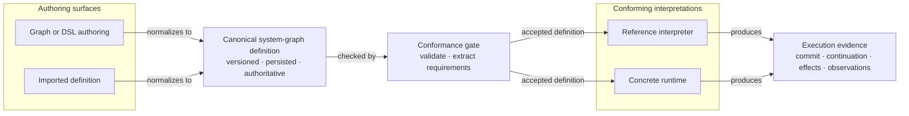

# System Language and Realization

Cohesive aims to provide a standard language for describing systems and a family of compiler-like realizations that project that language into working infrastructure.

The language goal begins with conceptual precision: define stable, boundary-relative meanings for what constitutes a system, how its parts are related and behave, and how that behavior is observed, constrained, authorized, and coordinated. The same term should not silently mean one thing in domain modeling, another in distributed systems, and a third in implementation code.

The language is more than a descriptive vocabulary. Concepts that determine behavior should have explicit composition, evaluation, and observation rules, or explicit mappings to system-graph structures that do. A model can therefore characterize possible executions and their required guarantees before any substrate is selected. [[Execution Kernel|Canonical execution definitions]], reference interpreters, and compiler-like lowerings can make this executable meaning concrete without making a particular runtime the source of meaning.

The realization goal is practical: carry those meanings and execution rules into working infrastructure. A compiler-like realization lowers semantic roles, executable system-graph structures such as [[Process Graphs|process graphs]], operational guarantees, and graph relationships into substrate choices such as actors, transactions, logs, brokers, durable workflows, storage systems, protocols, schedulers, and deployment topology while preserving the meanings that matter.

> **[[Realization|Realization]] is not a synonym for implementation.** Implementation creates concrete artifacts. Realization relates an artifact back to the semantic role it hosts, carries, preserves, or partially approximates.
>
> For example, an actor runtime implements message dispatch; realization asks which semantic transitions are carried by that dispatch, which ordering guarantees it preserves, and which failure boundaries limit those guarantees.

## Categorical Orientation

For Cohesive, category theory is not decoration and not a requirement that every note be formalized. It is a precision discipline:

- For [[Functoriality|functoriality]], ask which identities, transitions, dependencies, observations, and compositions must be preserved by a mapping.
- For [[Naturality|naturality]], ask whether a transformation depends on accidental representation choices.
- For [[Universal Constructions|universal constructions]], ask what diagram makes an object canonical.
- For [[Duality and Symmetry|duality and symmetry]], ask which paired concepts should be kept together without being collapsed—for example, keeping an event schedule and the state history derived from it as related views of [[Behavior|behavior]] rather than identical representations.
- For [[Sheaves and Gluing|sheaves and gluing]], ask when local observations agree enough to assemble into a coherent global view—for example, requiring independently evolved local histories to agree on shared events before assembling a larger history.
- For [[Trace and Feedback|trace and feedback]], ask how outputs become later inputs without losing boundary, delay, ordering, or recovery semantics—for example, retaining correlation and causation when an emitted message later resumes a waiting process.
- For [[Process Theories|process theories]], ask how work unfolds, composes, interacts, and feeds back over time.
- For [[Nondeterminism and Choice|nondeterminism and choice]], ask which continuations are possible and where their resolution belongs.
- For [[Reduction, Evaluation, and Confluence|reduction, evaluation, and confluence]], ask whether different computational paths preserve or rejoin the intended meaning.

The practical test is whether these disciplines help build systems that run. A Cohesive description should support realization into infrastructure without erasing the semantic distinctions that made the description useful.

[[Pattern Languages and Correspondence|Pattern languages and correspondence]] applies this orientation to established pattern catalogs. Each catalog is treated as a source vocabulary with a characteristic center of gravity: the dominant structural, behavioral, operational, or organizational concern around which its entries cluster. Its entries are decomposed into semantic trace, system-graph structure, operational obligations, architecture-practice role, and realization choices, with explicit preservation conditions between them.

## Compiler-Like Realization

A Cohesive compiler does not need to be one executable program. It may be a family of generators, validators, runtimes, adapters, schema compilers, migration tools, planners, or human-reviewed lowering rules. What makes the activity compiler-like is preservation of meaning across layers.

A realization compiler should make these correspondences explicit:

- Which semantic objects and relations are being lowered.
- Which [[System Graph|system graph]] structures arrange those objects.
- Which [[Infrastructure Graph|infrastructure graph]] projection relates those structures to public substrate roles.
- Which operational concerns must hold at which boundary.
- Which substrate mechanisms realize each role.
- Which diagrams, invariants, orderings, and effects must be preserved.
- Which information is intentionally forgotten, delayed, approximated, quotiented (identified under a declared equivalence), or made commutative (allowed to reorder without changing meaning).
- Which guarantees are local to one substrate boundary and which compose across the whole system.

## Layered Data Models

Data-intensive systems commonly pass through several models before reaching physical representation:

```txt
domain meaning
  -> semantic entities, relations, values, events, and observations
  -> system-graph models, shapes, queries, projections, and interfaces
  -> relational, document, graph, key-value, columnar, log, or stream model
  -> records, indexes, pages, segments, buffers, and bytes
```

Each arrow is a realization or interpretation relation, not an identity. A semantic [[Relation|relation]] is not a foreign key or graph edge; an [[Entity|entity]] is not a row or document; an [[Event|event]] is not any record in an append-only log; and a [[Shape|shape]] is not its serialization layout. One substrate model may realize several semantic structures, and one semantic structure may be distributed across several substrate representations.

Model choice shapes which relationships, access paths, updates, constraints, and evolution operations are direct or expensive. Embedding can preserve aggregate locality while making independently evolving many-to-many relations awkward. Normalized relations can make joins and constraints explicit while requiring query planning and indexes. Graph representations can expose traversal structure without establishing the domain meaning or authority of an edge. Columnar and log-oriented representations optimize other access and update patterns. These are realization tradeoffs, not competing definitions of the semantic concepts.

A lowering should therefore state:

- Which semantic identities, relations, shapes, orders, and constraints are preserved directly.
- Which joins, traversals, indexes, materializations, or application procedures reconstruct omitted structure.
- Which information is duplicated, denormalized, approximated, or forgotten.
- Which access patterns and update paths the representation privileges.
- Which transaction, consistency, locality, retention, and compatibility boundaries the mapping introduces.
- How schema and representation evolution preserve old stored material and independently deployed readers.

This layered view also localizes impedance mismatch. A mismatch is not merely between objects and tables; it is any point where the source and target models express identity, relationship, multiplicity, absence, ordering, version, or authority differently. Compiler-like realization should expose that difference and the law or validation evidence by which the translation remains acceptable.

## Cross-Realm Projection

A complete system description can be viewed as a cross-realm realization of one related graph, not as several unrelated diagrams. Domain semantics supplies meaning-bearing objects and relations. The system graph bundles and connects them into entities, processes, services, interfaces, and flows. Realization maps that structure onto code and infrastructure. Operational concerns are requirements on the nodes, edges, and mappings in that projection.

  
*Operational concerns qualify nodes, edges, and mappings at declared boundaries.*

The arrows are typed correspondences, not identities. An entity may be authoritative in one service but projected by another. A process may span several services. A service may map to many modules, deployables, and instances, while a repository may contain many services. An interface may have local, HTTP, RPC, broker, or file-based bindings without changing its semantic contract.

Let `G` be the semantic and system graph, `R` a candidate substrate graph, `ρ` a realization mapping, `P` the requirements attached to graph elements and mappings, and `B` the boundary at which they are claimed. A compact realization judgment is:

```text
G; P @ B ⊢ ρ : G -> R
```

`G` appears on both sides because the semantic and system graph is both the context in which `P` is defined and the source graph that `ρ` lowers.

The judgment is acceptable only when capability evidence for `R` demonstrates every required property in `P` at its declared boundary and the composed mappings preserve the relationships that matter. Requirements that qualify the projection include [[Cohesive System Model#2. Operational Concerns|operational concerns]] and other boundary-relative demands, for example:

- Concurrency, ordering, and consistency.
- Throughput, queue bounds, and scaling.
- Failure isolation and recovery.
- Authority and ownership.

These requirements constrain the projection without becoming semantic objects themselves.

The word *projection* is also used for a view that intentionally forgets detail. A semantic view, [[Service Models|service model]], code graph, team graph, deployment topology, and runtime scheduling graph may all be projections of the same realized system. Each view must state which structure it preserves and which detail it omits.

Monotone co-design provides an instructive precedent for this cross-realm discipline. It distinguishes functionality provided, implementations selected, and resources required, then defines how design problems compose while those spaces retain their different meanings. Cohesive adopts the same broad commitment to composable, related descriptions without identifying its realms with those three spaces: domain semantics states meaning, the system graph states composition and placement, operational concerns qualify the required behavior at boundaries, and the realization substrate supplies candidate mechanisms and capability evidence.

## Canonical Execution Definitions

Compiler-like realization may use a persisted, versioned canonical execution definition as the intermediate authority between authoring and interpretation. [[Transition Models|Transition models]] and [[Process Graphs|process graphs]] are especially suited to this form because their branches, observations, outcomes, patches, emissions, waits, joins, recovery policy, and guarantee demands must remain stable across several interpreters and long-lived executions.



*One authoritative definition, multiple conforming interpretations.*

For instance, a [[Process Graphs|process graph]] authored in a DSL may be serialized as a versioned canonical JSON definition, validated against declared invariants and effect boundaries, and interpreted by a workflow runtime that commits state transitions and emits events.

This intermediate authority does not collapse domain semantics into serialization. The semantic entity, transition, process, state, event, and effect remain defined by the conceptual graph. The canonical definition is the selected portable structure that makes their executable relationships inspectable, comparable, and attributable.

Host-language control flow, generated code, runtime registrations, checkpoints, storage schemas, backend plans, and deployment artifacts are derived artifacts or interpretations.

> **Canonical-definition authority.** When a derived artifact conflicts with its canonical definition, the definition remains authoritative. Only an explicitly accepted semantic change recorded as a new revision can replace it.

[[Execution Kernel|An execution kernel]] supplies the shared identity, versioning, portable-value, validation, interpretation, requirement, trace, and conformance contracts for this boundary without requiring one monolithic runtime or package.

Examples:

- A process graph may lower into a workflow engine, a database-backed process manager, an actor, an event-sourced coordinator, a queue consumer, or a set of cooperating observer models.
- An entity model may lower into an actor-hosted aggregate, a database row with expected-version checks, an event stream plus reconstitution, or a replicated object.
- A flow view may lower into a call, channel, broker topic, log subscription, shared-state interaction, or protocol session.
- A transition may lower into a transaction, actor turn, compare-and-swap, replicated-log application, workflow decision, or command handler plus effect boundary.

These are valid only when the chosen realization preserves the required identity, boundary, ordering, persistence, recovery, interaction, and effect semantics.

## Traceability

Every public Cohesive building block should be traceable to a well-defined concept in this graph. The reverse direction is equally important: graph concepts should state how they constrain, guide, or appear in building blocks.

Traceability need not be exhaustive or one-to-one. A concept may identify the building blocks it informs or could inform without claiming complete coverage; partial reverse traceability is acceptable and expected. A concept may have several realizations, no current realization, or only a partial realization, and a building block may combine several concepts. The important requirement is that the relationship be explicit enough to review.

When reconciling a building block against the graph, ask:

- Which graph concepts define the block's meaning?
- Which operational guarantees does the block claim?
- Where are the boundaries of those guarantees?
- Which realization choices make the block executable?
- Which distinctions are preserved, which are hidden, and which are intentionally unavailable?
- What failure modes appear when a substrate mechanism is mistaken for the semantic concept itself?

## Public and Private Layers

This repository is the public conceptual graph. It can define concepts, distinctions, relations, and public realization families. Private implementation details, customer-specific mappings, unreleased modules, credentials, and paid-feed content belong outside this repository.

The public graph should still be strong enough to support private system graph and realization graph work. A public [[Infrastructure Graph|infrastructure graph]] can name substrate roles and guarantee boundaries, while a private realization graph may map a public concept to concrete code, runtime, infrastructure, or product artifacts. The public concept remains the source of meaning.

## Guiding Checks

- Does the description begin with semantic meaning before naming infrastructure?
- Does it state the boundary at which each term, guarantee, or equivalence holds?
- Does it identify which choices remain open, who has authority to resolve them, and which scheduling or fairness assumptions shape executions?
- Does it distinguish semantic roles from system graph structures, operational concerns, and substrate mechanisms?
- Does it distinguish language-level execution semantics from the substrate mechanisms that interpret or realize them?
- Do its realization mappings preserve structure rather than merely match names?
- Does it make each loss of information explicit?
- Does it allow multiple valid realizations rather than treating them as ambiguity to erase?
- Does it treat working systems as the validation target for the language?

Related concepts by realm:

- **Principles:** [[Categorical Principles|categorical principles]], [[Pattern Languages and Correspondence|pattern languages and correspondence]], [[Process Theories|process theories]], [[Compositionality|compositionality]], and [[Execution Kernel|execution kernel]].
- **Domain semantics:** [[Boundaries|boundaries]], [[Observer|observer]], [[Entity|entity]], [[Process|process]], [[Relation|relation]], [[Transition|transition]], [[Effect|semantic effect]], and [[Authority|authority]].
- **System graph:** [[System Graph|system graph]], [[Transition Models|transition models]], [[Process Graphs|process graphs]], [[Effects|effect structure]], and [[Infrastructure Graph|infrastructure graph]].
- **Operational concerns:** [[Compatibility and Evolution|compatibility and evolution]], [[Coordination|coordination]], [[Scheduling|scheduling]], and [[Fairness|fairness]].
- **Architecture practices:** [[Architecture Practices|architecture practices]].
- **Realization substrate:** [[Realization|realization]] and [[Storage Systems|storage systems]].

## External References

- Brendan Fong and David I. Spivak, [*An Invitation to Applied Category Theory: Seven Sketches in Compositionality*](https://arxiv.org/abs/1803.05316), Cambridge University Press, 2019, especially Chapter 4 on collaborative design. [DOI](https://doi.org/10.1017/9781108668804)
- Andrea Censi, [*A Mathematical Theory of Co-Design*](https://arxiv.org/abs/1512.08055), Laboratory for Information and Decision Systems, MIT, 2016.
