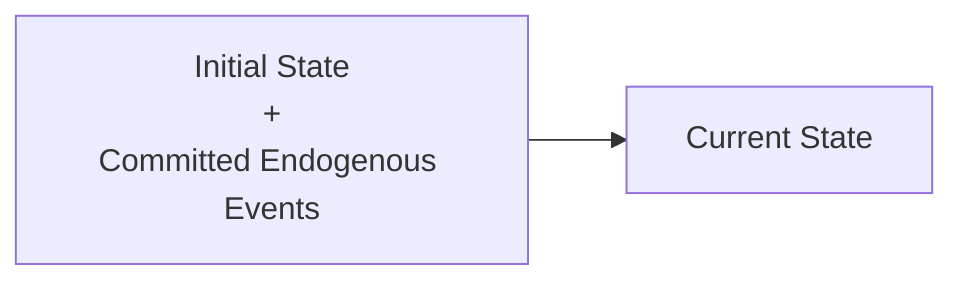
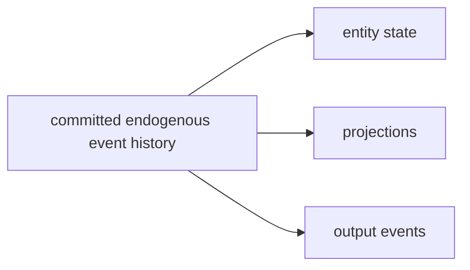

# Event Sourcing

Event sourcing is a realization pattern in which an entity's durable history is represented by committed [[Event|events]] rather than only by current-state records.

In the Cohesive System Model, event-sourced events are not merely time-bearing values. They are committed endogenous events: events accepted within an [[Observer|observer]] boundary as the result of a valid [[Transition|transition]]. Once committed, they can be treated as state actions:
$$
\mathrm{event}\colon\text{State}\to\text{State}
$$
Reconstitution then folds the committed event schedule from an initial state or snapshot to recover current entity state:

The word committed is essential. Event sourcing is interested in committed events because they maintain consistency:

- Only committed events advance the entity [[Version|version]].
- Rejected commands do not produce committed events for the target entity.
- Nil endogenous events record no domain transition for the target entity.
- Expected-version checks, transactions, actor serialization, or compare-and-swap operations ensure that only valid successors enter the history.
- Reconstitution, projections, audit, recovery, and downstream publication must be based on the committed history, not merely on attempted inputs.

Exogenous events, messages, commands, retries, telemetry, and rejection records may be persisted elsewhere, but they are not automatically part of the entity's event-sourced state history. They become part of that history only if interpreted and committed as endogenous events for the entity boundary.

Event sourcing therefore realizes several concepts together:

- [[Persistence]] as durable committed event history.
- [[Reconstitution]] as replay or snapshot-plus-replay.
- [[Concurrency Control]] as protection of the versioned event schedule.
- [[Event-State Duality]] as the relation between committed event history and state history.
- [[Behavior]] as the trajectory obtained by folding committed events and applying a hold or interpolation rule.

Event sourcing is often combined with [[CQRS]], but the patterns are distinct. Event sourcing chooses committed event history as authoritative persistence; CQRS separates command-side consistency from query-side reconstitution and projection.

## Relationship to Outbox
Event sourcing can also act as a coordination substrate when the committed event history is the source from which projections, [[Process Managers|process managers]], subscribers, and outbound publications are driven.

This gives an atomic unification of persistence and orchestration:


The event append is the local commit that makes both state history and follow-up responsibility observable. Publication and downstream processing still have their own [[Delivery Semantics|delivery semantics]], [[Acknowledgments|acknowledgments]], retry, and idempotency requirements, but the trigger for that work is durably tied to the authoritative transition.

If an event-sourced system appends the event and separately writes an unrelated broker message with no recovery link, it reintroduces the [[Dual-Write Problem|dual-write problem]]. A separate [[Outbox|outbox]] may still be useful, but it must either be committed atomically with the event append or derived reliably from the committed event history.

## Multi-Step Workflows

Event sourcing can help with the [[Dual-Write Problem|dual-write problem]] in a multi-step workflow only to the extent that the workflow's progress is represented by committed events. If a sequence is:

```txt
step A completes -> step B starts -> step B completes -> step C starts
```

then an event-sourced solution needs durable events for the meaningful completions that drive the next step, such as `OrderPlaced`, `PaymentCaptured`, `ShipmentBooked`, or `RefundIssued`. Each event becomes the committed fact from which the next process decision, projection, or outbound publication is derived.

That is a good fit when each step completion is a domain-relevant fact that belongs in the entity or process history. It is a weaker fit when the sequence is mostly execution bookkeeping, such as:

- Call an external fraud API, retry with backoff, then continue when a transient `200 OK` response arrives.
- Wait three days for a human approval, send reminders, time out, and resume the same suspended computation.
- Upload a generated document, poll until it is processed, then call another API with the resulting file id.
- Reserve capacity, schedule a timer, renew a lease, and compensate only if a later external participant fails.

Those steps may need durable records, but not every completion is necessarily a committed domain event. Forcing every execution checkpoint into the event-sourced domain history can pollute the model with operational facts, confuse business history with runtime progress, and still leave external effects with their own commit and acknowledgment boundaries.

In those cases, [[Durable Execution|durable execution]], a [[Process Managers|process manager]], or a [[Sagas|saga]] may be the better realization. Event sourcing can still record the domain facts, while durable execution records execution progress, timers, retries, signals, activity completion, and recovery context.

## Consumption Capabilities

Event sourcing does not by itself guarantee fanout, competing consumers, consumer groups, independent subscription offsets, replay isolation, or parallel consumption. Those are capabilities of the concrete event store, broker, stream processor, relay, or projection infrastructure used to expose the committed history.

Some implementations make the committed event history directly consumable by many independent subscribers. Others require a relay that publishes committed events to a fanout-capable [[Brokers|broker]] or stream. Competing consumers and consumer groups likewise depend on the substrate's partitioning, ordering, acknowledgment, offset, lease, and retry model.

The architectural claim should therefore name both layers: event sourcing makes committed entity history authoritative, while the chosen consumption substrate defines fanout, ordering scope, delivery semantics, replay behavior, and recovery obligations.

## System Composition and Geo-Replication

Event sourcing can also act as a composition point for downstream systems. When the source-of-truth event store is geo-replicated, downstream systems can sometimes inherit that geo-replication by consuming from a regional replica of the committed log.

For example, a regional [[Brokers|broker]] such as Kafka may provide local fanout and distribution even when it is not the source of truth. A search index, SQL read model, cache, or projection store may likewise be rebuilt or hydrated from the replicated event log rather than independently geo-replicated with its own mechanism.

This is not automatic geo-replication for every component. The guarantee depends on where the consumer reads in the replication topology, how offsets are tracked, what ordering the replicated log preserves, and whether the downstream system can be rebuilt from the log after failure.

One useful arrangement is a cross-region replication chain. The head accepts writes, replication carries committed events across data-center boundaries, and downstream consumers may attach to a middle or tail replica. A consumer of the tail can treat event visibility as evidence that the event has crossed the preceding replication boundary, but it also inherits the chain's latency, availability, data-loss, failover, and consistency tradeoffs.

## ARIES and Event Sourcing
ARIES is relevant by analogy and contrast. In a database, the transaction log is often an internal [[Write-Ahead Logging|write-ahead]] recovery structure used for redo, undo, checkpoints, and crash recovery. In event-sourced systems, the event log is usually an addressable, first-class primitive of the application model: committed events define entity history, version succession, reconstitution, projection, audit, and sometimes publication. The logs therefore have different semantics. ARIES log records are recovery records for a storage engine. Event-sourced records are committed domain events for an entity boundary. Both make durable ordered history central to [[Persistence|persistence]], [[Reconstitution|reconstitution]], and [[Recovery|recovery]].

## External References

- Martin Fowler, [Event Sourcing](https://martinfowler.com/eaaDev/EventSourcing.html), 2005.
- Greg Young, [CQRS Documents](https://cqrs.files.wordpress.com/2010/11/cqrs_documents.pdf), 2010.
- Microsoft Azure Architecture Center, [Event Sourcing pattern](https://learn.microsoft.com/en-us/azure/architecture/patterns/event-sourcing).
- Leo Gorodinski, [Scaling Event-Sourcing at Jet](https://www.gorodinski.com/Scaling-event-sourcing-at-Jet-3188cf7881f9801fa107c32aaaace320), 2017.
- C. Mohan, Don Haderle, Bruce Lindsay, Hamid Pirahesh, and Peter Schwarz, [ARIES: A Transaction Recovery Method Supporting Fine-Granularity Locking and Partial Rollbacks Using Write-Ahead Logging](https://web.stanford.edu/class/cs345d-01/rl/aries.pdf), ACM Transactions on Database Systems, 17(1):94-162, March 1992.

Related concepts: [[Event|event]], [[State|state]], [[Transition|transition]], [[Entity|entity]], [[Version|version]], [[Persistence|persistence]], [[Reconstitution|reconstitution]], [[Recovery|recovery]], [[Write-Ahead Logging|write-ahead logging]], [[Commit Boundaries|commit boundaries]], [[Effects|effects]], [[Delivery Semantics|delivery semantics]], [[Acknowledgments|acknowledgments]], [[Ordering|ordering]], [[Idempotency|idempotency]], [[Concurrency Control|concurrency control]], [[Event-State Duality|event-state duality]], [[Behavior|behavior]], [[Outbox|outbox]], [[Transactional Outbox|transactional outbox]], [[Dual-Write Problem|dual-write problem]], [[Process Managers|process managers]], [[Sagas|sagas]], [[Durable Execution|durable execution]], [[CQRS]], [[Brokers|brokers]], [[Storage Systems|storage systems]], [[Projection Models|projection models]], [[Realization|realization]].
