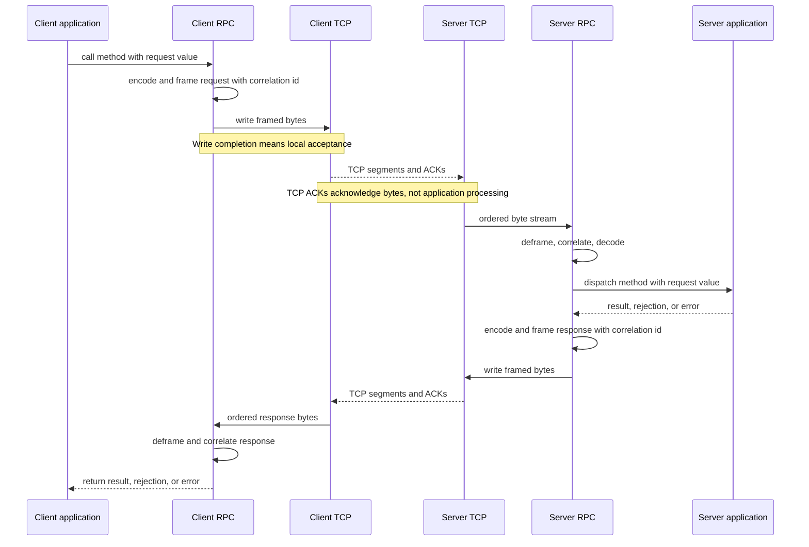

# Network

Realm: Realization Substrate

Network is the realization substrate for interaction across link, network, transport, and application protocol boundaries.

Network mechanisms [[Realization|realize]] interaction edges, but they are not the definition of [[Interaction]]. Interaction also occurs locally between processes, threads, runtime tasks, actors, CPU cores, memory cells, and synchronization primitives. Networked interaction is one important family of realization.

## Application Interaction From Async Send/Receive

At the bottom of the software network stack, interaction can be modeled as asynchronous send and receive:

- A send operation hands data to a local protocol boundary. Completion usually means local acceptance, not remote receipt, processing, or commitment.
- A receive operation observes data that has already been admitted by the local protocol stack.

Protocol layers add structure to this minimal edge:

- Ethernet adds a link-local frame as an atomic transmission unit. Failed or corrupt frames are generally dropped; recovery, if needed, is provided by another layer.
- IP adds network-level addressing and routing across links. It provides best-effort datagrams, not reliable end-to-end delivery.
- UDP adds transport demultiplexing through ports and preserves datagram boundaries, but does not add ordering, reliability, or congestion control.
- TCP adds ordering, retransmission, flow control, and congestion control, forming a full-duplex connection with an ordered byte stream in each direction. It orders bytes within a connection, not application messages, and TCP acknowledgments do not imply application processing or durable commit.
- HTTP, RPC, WebSockets, gRPC, and custom protocols add application-level framing, correlation, multiplexing, status, metadata, request/reply, and streaming semantics.
- Queues, logs, topics, and brokers reify channel state as system entities. Clients typically interact with them through lower-level request/reply protocols, thereby implementing higher-level publish/consume, subscription, cursor, retention, and delivery semantics.
- Application flows compose those protocols into domain-level interactions and [[Business Transactions]] involving services, humans, agents, policies, entities, and processes.

This ladder is not a strict hierarchy of concepts. The same interaction edge shape can reappear at different layers. UDP multicast and a Kafka topic are both one-to-many publication configurations at different realization boundaries, with very different addressing, durability, ordering, retention, and acknowledgment semantics.

## RPC Over TCP

TCP realizes a bidirectional ordered byte-stream interaction edge. It does not provide application messages, method calls, request/reply correlation, or domain commitment.

RPC coordinates atop TCP by adding an application-level protocol over the byte stream:

- **Framing**: divides the byte stream into application messages. Without framing, a receiver only sees bytes; it cannot know where one request or response ends and the next begins.
- **Correlation**: associates a response with the request that caused it. This is required when multiple calls are in flight over one connection.
- **Multiplexing and demultiplexing**: allow several logical request/reply interactions to share one stream or connection.
- **Dispatch**: names the operation, method, route, actor, service, or procedure the receiver should invoke.
- **Payload shape**: declares how request and response values are encoded, decoded, validated, and interpreted.
- **Status and errors**: distinguish success, application rejection, protocol error, timeout, cancellation, and transport failure.
- **Metadata**: carries headers, deadlines, authentication, tracing, content type, compression, or feature negotiation.

These additions realize application-level [[Interaction|request/reply]] over a lower-level stream/session edge. The request may then be interpreted semantically as a [[Command]], [[Query]], subscription request, negotiation, or another input role by the receiving [[Observer]].

The boundary of each guarantee must remain explicit:

- A successful socket send usually means local TCP acceptance.
- A TCP acknowledgment means the peer TCP stack acknowledged bytes in the stream.
- A complete RPC response means the application protocol produced a correlated reply.
- A successful command response means only what that application defines: accepted, validated, processed, persisted, committed, scheduled, or something narrower.

RPC therefore coordinates bytes into messages and messages into request/reply interactions, but it does not by itself prove that a domain transition committed. That requires observer-relative interpretation, validation, persistence, and an explicit commitment boundary.

## Mapping Guarantees

Network guarantees must be mapped to the boundary where they hold:

- What is addressed?
- What unit is delivered?
- What does acknowledgment mean?
- What ordering is preserved?
- What can fail independently?
- What is durable or replayable?
- What interpretation turns transmitted values into commands, [[Query|queries]], events, observations, or decisions?

Network behavior does not automatically equal domain commitment. The receiving [[Observer]] still interprets the value relative to its boundary, validates it, and may or may not commit a transition.

Related concepts: [[Realization]], [[Interaction]], [[Delivery Semantics]], [[Ordering]], [[Observer]], [[Command]], [[Query]], [[Event]], [[Brokers]], [[Application Hosts]], [[Coordination]].
