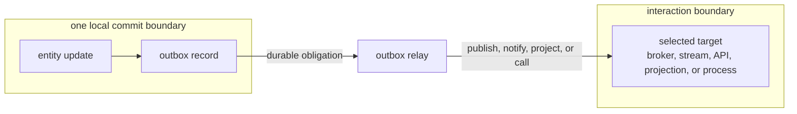

# Outbox

An outbox is a realization pattern that stores an outbound effect obligation in durable persistence, usually in the same local commit boundary as the state change that created the obligation.

The outbox record is not the downstream effect itself. It is durable operational material that says the local boundary accepted responsibility to publish, notify, project, call, or otherwise drive follow-up work.

## Mechanism

An outbox may be realized by:

- A relational table written in the same transaction as domain state.
- A document or item in the same partition transaction as aggregate state.
- A committed event stream that doubles as the outbound work source.
- A database change feed over committed records.
- Actor or workflow state that records pending outbound effects.
- A durable job or publication queue owned by the same local persistence boundary.

The relay, dispatcher, projector, or publisher reads the durable obligation and attempts the external effect. It then records enough progress for retry, deduplication, ordering, or recovery.

## Guarantees

Outbox guarantees are scoped:

- The local commit can atomically persist state change and publication responsibility.
- Publication happens later and has its own [[Delivery Semantics|delivery semantics]], [[Acknowledgments|acknowledgments]], ordering, retry, and recovery behavior.
- Downstream processing is not guaranteed by the outbox alone.
- Fanout is not guaranteed by the outbox alone. When multiple independent consumers need the effect, the relay usually publishes once to a fanout-capable [[Brokers|broker]] or stream, and that substrate owns subscriber fanout and delivery semantics.
- Duplicate publication is common under retry and recovery, so consumers usually need [[Idempotency|idempotency]], deduplication, or a [[Transactional Inbox|transactional inbox]].

Outbox therefore replaces unsafe dual writes with local atomicity plus asynchronous responsibility. It does not turn asynchronous interaction into distributed atomic commit.

## Multi-Step Workflows

An outbox solves the producer-side handoff for one local commit boundary. It does not by itself make a multi-step workflow durable or atomic across all steps.

If a sequential workflow uses outbox records to avoid dual writes, each step that matters to later progress needs its own durable representation: a committed domain event, a process-state transition, an outbox obligation, an inbox or deduplication record, or another recovery record. Otherwise a failure can still leave the workflow after one completed step and before the next durable trigger.

When the workflow is mostly a sequence of long-running activities, timers, external calls, retries, signals, or compensation decisions, [[Durable Execution|durable execution]], [[Process Managers|process managers]], or [[Sagas|sagas]] may be a better fit than treating every step completion as an outbox-driven domain event.

## Relationship to Event Sourcing

[[Event Sourcing]] can act like an atomic unification of persistence and coordination when committed endogenous events are both:

- The authoritative durable history used to reconstitute entity state.
- The durable source from which projections, [[Process Managers|process managers]], subscribers, or outbound publications are driven.

In that arrangement, the system does not separately write state and then separately decide whether orchestration should happen. The committed event history is the shared basis for both persistence and follow-up coordination.

This unification is required when consistency depends on downstream work being causally tied to accepted state transitions. If a system commits an event-sourced transition and then publishes a separate broker message through an independent write with no recovery link, the [[Dual-Write Problem|dual-write problem]] returns. A separate outbox record can still be used, but it must be committed atomically with the event append or derived reliably from the committed event history.

Related concepts: [[Transactional Outbox|transactional outbox]], [[Persistence|persistence]], [[Commit Boundaries|commit boundaries]], [[Effects|effects]], [[Acknowledgments|acknowledgments]], [[Delivery Semantics|delivery semantics]], [[Ordering|ordering]], [[Retry|retry]], [[Recovery|recovery]], [[Idempotency|idempotency]], [[Transactional Inbox|transactional inbox]], [[Dual-Write Problem|dual-write problem]], [[Event Sourcing|event sourcing]], [[Process Managers|process managers]], [[Sagas|sagas]], [[Durable Execution|durable execution]], [[CQRS]], [[Brokers|brokers]], [[Storage Systems|storage systems]], [[Realization|realization]].
