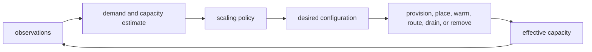

# Scaling Mechanisms

Scaling mechanisms are concrete ways to change resource capacity, execution population, or system topology in an attempt to improve [[Scalability|scalability]] or elasticity.

They include changing resource allocations, adding or removing execution units, realizing [[Replica Models|replica models]], decomposing responsibilities, realizing [[Partition Models|partition models]], redistributing ownership, and controlling these changes automatically. A mechanism changes a realization; it does not prove that useful capacity increased or that semantic and operational guarantees were preserved.

In [[Stuff Structure Property|stuff, structure, and property]] terms, scaling mechanisms change substrate stuff or structure in pursuit of an operational property. The realization judgment must show that the changed structure still preserves the system model's identities, authorities, interfaces, protocols, commitments, and recovery meanings.

## Vertical and Horizontal Scaling

**Vertical scaling**, or scaling up and down, changes the capacity of an existing resource or allocation. Examples include adding CPU, memory, bandwidth, storage service rate, connection capacity, worker permits, or runtime limits to one host, process, database, broker, or partition.

Vertical scaling can preserve a simpler topology, but it encounters resource ceilings, may enlarge a failure boundary, and may require restart, migration, or disruption. A dynamically resized allocation is still vertical scaling even when a controller performs it automatically.

**Horizontal scaling**, or scaling out and in, changes the population of capacity-bearing units. Units may be application instances, workers, consumers, replicas, storage nodes, partitions, shards, regions, or another schedulable and routable unit.

Horizontal units are not automatically interchangeable. Stateful scaling requires explicit partition or entity [[Identity|identity]], [[Authority|ownership]], placement, routing, fencing, [[Persistence|persistence]], [[Reconstitution|reconstitution]], [[Ordering|ordering]], [[Idempotency|idempotency]], [[Recovery|recovery]], and rebalancing semantics. Adding units can move a bottleneck to a shared dependency, destroy [[Locality|locality]], or add enough coordination and churn to reduce useful throughput.

Vertical and horizontal scaling can be combined. A system may resize each partition vertically, add partitions horizontally, and change the functional decomposition that determines which partitions exist.

## Scale Cube

The AKF scale cube distinguishes three broadly independent strategies:

| Axis | Strategy | System-graph and realization obligations |
| --- | --- | --- |
| X | Clone or replicate equivalent units | [[Routing Models\|Distribution]], replica identity, readiness, shared-state contention, failure and recovery |
| Y | Decompose by function or capability | [[Service Models\|Service]] boundaries, [[Interfaces\|interfaces]], [[Interaction Protocols\|interaction protocols]], ownership, compatibility, and cross-service coordination |
| Z | Partition similar work or data by key, tenant, range, geography, or another rule | Partition identity, routing, skew, ownership, [[Consumer Coordination\|assignment]], rebalancing, cross-partition operations, and recovery |

X-axis cloning is one form of horizontal scaling, not a synonym for all horizontal scaling. Z-axis partitioning also adds horizontal units. Y-axis decomposition changes the [[System Graph|system graph]] so capabilities can evolve, fail, and scale independently; it is not merely an infrastructure operation.

[[Routing Models|Routing]], [[Multiplexing and Demultiplexing|multiplexing and demultiplexing]], and [[Consumer Coordination|consumer coordination]] realize much of the X- and Z-axis distribution. Their keys, assignments, cursors, leases, acknowledgments, and ownership epochs determine whether added units receive balanced useful work or create duplicates, gaps, hotspots, and stale owners.

Y-axis decomposition does not require networked [[Microservice Architecture|microservices]]. It can be realized through a [[Modular Monolith|modular monolith]], processes, application hosts, services, stores, or other boundaries. The scaling claim depends on whether function and demand can vary independently and whether the new [[Interaction|interactions]] and coordination cost preserve useful capacity. [[Asynchronous Interaction Design|Asynchronous interaction design]] can decouple cadence and failure but introduces backlog, delivery, retention, and recovery obligations rather than removing them.

Vertical scaling is not an axis of the cube. It changes the capacity of a unit at any point within the cube. The cube is a design vocabulary for changing structure, not a measurement model or a scalability guarantee. A system can combine all three axes and still be limited by one hot authority, globally ordered decision, shared store, network boundary, or operational control plane.

## Autoscaling as a Control Loop

Autoscaling is an [[Operational Control|operational control]] and [[Trace and Feedback|feedback]] loop that observes a system, estimates required capacity, selects a desired configuration, and actuates resource or topology changes. A [[Control Models|control model]] can describe that loop without identifying it with one autoscaler implementation.

The loop's observations may include offered or admitted demand, queue age, backlog, useful throughput, latency, saturation, utilization, rejection rate, errors, partition skew, or forecasts. These measurements are boundary-relative. High CPU utilization may indicate productive saturation, retry amplification, coordination overhead, or recovery work; the same numeric signal can require different actions. Aggregate signals can also hide violations of [[Fairness|fairness]] or one tenant, key, partition, region, or priority [[Policy Scopes|policy scope]].

Requested capacity, allocated capacity, started capacity, ready capacity, effective capacity, and draining capacity are different states. A controller acknowledgment that changes desired replica count does not prove that new capacity is placed, warm, authorized, routed, or producing useful completions.

An [[Additive Increase Multiplicative Decrease|AIMD]] controller can cautiously probe a capacity or population limit and retreat quickly on overload evidence. [[PID Control|PI or PID control]] can regulate a numeric capacity signal toward a target when its sign, units, delay, saturation, and noise behavior are understood. Neither controller family removes autoscaling lifecycle delay: requested capacity and achieved effective capacity must remain distinct in the feedback model.

### Scale-Out and Scale-In Lifecycle

Scale-out can require allocation, placement, startup, code and data warmup, dependency connection, health evaluation, membership registration, ownership or lease assignment, routing convergence, state transfer, and admission. Capacity is effective only after the relevant lifecycle has completed and its [[Delivery Semantics|delivery]], [[Acknowledgments|acknowledgment]], and [[Commit Boundaries|commit]] obligations are established.

Scale-in can require stopping new admissions, draining in-flight work, durably checkpointing or handing off execution material, transferring ownership, fencing the former owner, reassigning partitions, updating routes, and retaining enough evidence for [[Recovery|recovery]]. Terminating a unit before those boundaries are established can lose work, duplicate effects, split authority, or create repeated recovery. [[Compatibility and Evolution|Compatibility]] must also hold while old and new definitions, routes, members, or protocols coexist.

Stateless handlers can make some lifecycle steps cheap, but a stateless application host may still depend on stateful connection pools, caches, brokers, stores, rate limits, and downstream authorities. Statelessness at one boundary does not make the end-to-end scaling path stateless.

## Stability, Churn, and Competing Controllers

Autoscaling has observation, decision, actuation, and settling delays. Thresholds without hysteresis, stabilization windows, rate bounds, minimum residency, or readiness awareness can cause oscillation. Cold capacity may arrive after the demand spike, while premature scale-in can remove capacity before queues, caches, replicas, or partitions have stabilized.

Scaling churn includes instance turnover, cache and connection cold starts, membership changes, elections, partition reassignment, state transfer, route propagation, and repeated warmup or drain work. Churn consumes the same resources scaling is intended to provide, destroys locality, and can increase both local contention and distributed coordination.

Several controllers may also act on the same system: workload autoscalers, node provisioners, database controllers, partition rebalancers, retry policies, circuit breakers, load balancers, and deployment controllers. Individually reasonable loops can interact destructively when they observe different boundaries or operate at similar time scales. Their authorities, controlled variables, priorities, and settling assumptions should be explicit.

An autoscaler can make overload worse when it responds to a shared bottleneck by adding clients of that bottleneck. The new population can increase connection pressure, retries, lock contention, quorum work, cache invalidation, or rebalancing. [[Admission Control and Load Shedding|Admission control and load shedding]], [[Rate Limiting|rate limiting]], concurrency reduction, [[Flow Control|flow control]], coordination avoidance, or a change to partition and authority boundaries may improve useful throughput more than adding resources.

Delayed or reinforcing controller interactions can produce [[Metastability|metastability]]: the scaling, retry, recovery, or rebalance response sustains a degraded regime after the initiating disturbance disappears. [[Synchrony and Asynchrony|Synchronization]] among controller intervals, health probes, retries, or instance lifecycles can further concentrate churn; jitter and independent timing can reduce correlation without fixing an incorrect policy.

The [[Scalability|Universal Scalability Law]] provides one way to detect a retrograde concurrency region. If the current population exceeds the useful-capacity optimum, scaling in or throttling can increase completion throughput. Autoscaling policy should therefore optimize declared service outcomes rather than replica count, utilization, or admitted work in isolation.

[[Capacity Planning|Capacity planning]] establishes the demand envelope, reserves, quotas, provisioning lead times, and tested limits within which scaling controllers operate. Autoscaling cannot create unavailable quota, shorten a physical lead time, partition an unsplittable authority, or make a shared bottleneck scale merely by increasing desired capacity.

## Realization Judgment

A scaling realization should state:

- The workload, resource, topology, and useful-completion dimensions it intends to change.
- Which semantic and [[System Graph|system-graph]] roles are replicated, decomposed, partitioned, migrated, or left singular.
- Which identities, authorities, interfaces, protocols, policies, and invariants must remain stable.
- How work is distributed and how skew, hotspots, fanout, and shared dependencies are handled.
- The scale-out and scale-in lifecycle, including ready, drain, handoff, fence, and recovery boundaries.
- The observation interval, controller delays, hysteresis, rate bounds, and stabilization rules.
- How contention, coordination, and churn are measured locally and across distributed boundaries.
- What happens when the mechanism reaches quotas, placement limits, resource ceilings, or unavailable dependencies.
- How several scaling and recovery controllers compose without oscillation or conflicting authority.
- How locality, compatibility, delivery, ordering, idempotency, durability, and reconstitution behave while topology changes.

## External References

- Martin L. Abbott and Michael T. Fisher, [Scaling Your Systems in the Cloud: AKF Scale Cube Explained](https://theartofscalability.com/growth-blog/scaling-your-systems-in-the-cloud-akf-scale-cube-explained), summarizing the X-, Y-, and Z-axis vocabulary from *The Art of Scalability*.
- Kubernetes, [Horizontal Pod Autoscaling](https://kubernetes.io/docs/concepts/workloads/autoscaling/horizontal-pod-autoscale/), an example of a metric-driven scaling control loop with readiness handling and stabilization behavior.
- Tania Lorido-Botran, Jose Miguel-Alonso, and Jose A. Lozano, [A Review of Auto-scaling Techniques for Elastic Applications in Cloud Environments](https://doi.org/10.1007/s10723-014-9314-7), *Journal of Grid Computing* 12:559-592, 2014.

Related concepts: [[Stuff Structure Property|stuff structure property]], [[Scalability|scalability]], [[Capacity Planning|capacity planning]], [[Control Models|control models]], [[Admission Control and Load Shedding|admission control and load shedding]], [[Locality|locality]], [[Metastability|metastability]], [[Realization|realization]], [[Infrastructure Graph|infrastructure graph]], [[Replica Models|replica models]], [[Partition Models|partition models]], [[Routing Models|routing models]], [[Consumer Coordination|consumer coordination]], [[Identity|identity]], [[Authority|authority]], [[Compatibility and Evolution|compatibility and evolution]], [[Recovery|recovery]], [[Microservice Architecture|microservices]], [[Modular Monolith|modular monolith]].
