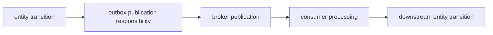

# Effects

Effects are modeled consequences of an accepted interpretation, transition, process step, or operational action.

An effect may be local to an [[Observer|observer]] or [[Entity|entity]] boundary, or it may cross a boundary through [[Interaction|interaction]]. Effects include committed endogenous [[Event|events]], output events, state writes, projection updates, outbox records, inbox records, messages, acknowledgments, offset commits, timers, workflow signals, documents, and calls to external systems.

Perhaps counterintuitively, a request to perform asynchronous computation can itself be modeled as an effect, not only the later response or result. Enqueuing work, sending a [[Command|command]], scheduling a timer, or signaling a [[Processes|process]] changes what some observer, runtime, or boundary is now committed to attempt. The completion event, returned observation, timeout, or failure is a later effect at another boundary.

In a coherent system model, each important effect should have an explicit subject, boundary, commitment meaning, ordering scope, failure behavior, and recovery rule.

## Effect systems in programming languages

Programming-language effect systems make some consequences of evaluation visible to the type system, runtime, or compiler instead of leaving them as untracked ambient behavior. They classify what a computation may do besides return a value: read or write state, perform I/O, allocate, suspend, throw, publish, call across a boundary, or require a capability.

Monadic encodings treat effectful computation as a value in a type constructor, often written `M A`, where `pure`, `bind`, and related operations sequence computations through a structured context. In categorical terms, these are [[Monads Monoids and Duals|monadic]] endofunctors with laws that preserve coherent sequencing. In system modeling terms, the monadic structure says that effects are not hidden afterthoughts; they are part of the shape of computation and constrain how computations compose.

Algebraic effects separate effect operations from their handlers. A program may request an operation such as `raise`, `await`, `log`, `choose`, or `get`, while a handler determines how that request is interpreted, resumed, transformed, or delimited. The same separation appears in the model when an effect is identified independently from the [[Boundaries|boundary]] that accepts, persists, observes, publishes, retries, or compensates it.

Exceptions are a familiar effect: evaluation may leave the ordinary return path and transfer control to a handler. Checked exceptions, result types, resumable exceptions, and unchecked exceptions differ in how explicit the effect is and where the handling boundary is drawn. The same distinction appears in systems: a failure may be explicit in a protocol, recorded as an [[Observation|observation]], retried by a process, compensated later, or allowed to escape as an operational fault.

Effect systems are therefore a programming-language analogue of explicit effect modeling. They do not by themselves define business commitment, [[Ordering|ordering]], [[Delivery Semantics|delivery semantics]], [[Recovery|recovery]], or [[Idempotency|idempotency]], but they can make those obligations visible in code and prevent accidental composition across incompatible effect boundaries.

## Effect scope and boundaries

An effect scope is the modeled extent within which an effect has a particular status, meaning, ordering rule, visibility, and recovery obligation.

An effect boundary is the edge of that scope: the point where the effect becomes accepted, persisted, observed, published, acknowledged, committed, retried, compensated, or abandoned.

A single business operation can pass through several effect scopes and boundaries:

Each scope has a distinct meaning. The entity transition may be committed while publication remains pending. Broker publication may be acknowledged before any consumer transition occurs. Consumer processing may complete before downstream business completion is visible.

The scope names what can rely on the effect and under which rule. The boundary names where that rule starts, changes, or ends.

## Duplicate Effects

Effects that may be retried, replayed, resumed, or redelivered need [[Idempotency|idempotency]], deduplication, expected-version checks, or another rule that prevents duplicate domain effects.

For example, handling the same input twice may produce a nil endogenous event for the target entity while still recording an operational observation that the duplicate was seen. Publishing the same outbox record twice may be acceptable only when the receiver has an idempotent protocol, deduplication record, or [[Transactional Inbox|inbox]].

Related concepts: [[Boundaries|boundaries]], [[Commit Boundaries|commit boundaries]], [[Acknowledgments|acknowledgments]], [[Interaction|interaction]], [[Delivery Semantics|delivery semantics]], [[Ordering|ordering]], [[Idempotency|idempotency]], [[Retry|retry]], [[Recovery|recovery]], [[Dual-Write Problem|dual-write problem]], [[Outbox|outbox]], [[Transactional Inbox|transactional inbox]], [[Business Transactions|business transactions]], [[Monads Monoids and Duals|monads]], [[Functoriality|functoriality]].
