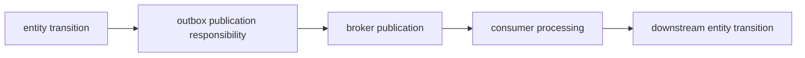

# Effects

An effect is a modeled consequence of an accepted interpretation, transition, process step, or operational action.

When an intended downstream consequence has not yet occurred, the present effect may instead be the establishment of an obligation or responsibility to attempt it. An [[Outbox|outbox]] record, for example, is a committed publication obligation rather than the downstream effect itself.

An effect may be local to an [[Observer|observer]] or [[Entity|entity]] boundary, or it may cross a boundary through [[Interaction|interaction]]. Effects include committed endogenous [[Event|events]], state writes, publication obligations, projection updates, outbox records, inbox records, messages, acknowledgments, offset commits, timers, workflow signals, documents, logging, memory allocation, and calls to external systems.

Events and effects emphasize different aspects of the same system activity. An event identifies an occurrence. An effect identifies a modeled consequence or obligation. A committed endogenous event may be the effect of an accepted transition, but not every effect is an event, and not every event is an effect of the subject currently being modeled.

## Semantic Roles of Effects

Effect roles are not mutually exclusive:

- A **transition effect** is the accepted evolution of an entity's state and [[Version|version]]. The occurrence of that evolution is an endogenous event. In [[Event Sourcing|event sourcing]], the committed event is the authoritative history of the transition effect.
- A **publication effect** establishes responsibility to externalize an event, fact, or notification. Publication does not imply that a receiver owes a semantic response. An acknowledgment may attest to publication, admission, or persistence without being a response to the published content.
- A **request effect** emits an event with the intent that another observer interpret or act on it and establishes a modeled continuation expecting a later response. Relative to the emitter, the carried event is an endogenous output event; relative to the receiver, it is an exogenous input event. It becomes a [[Command|command]], [[Query|query]], or another semantic role only through the receiver's interpretation. The response may be asynchronous, correlated through another channel, or observed indirectly through shared state.
- An **infrastructure effect** changes a runtime or infrastructure subject through logging, allocation, deallocation, cache mutation, offset advancement, scheduling, I/O, or similar activity. Such effects may produce telemetry or machine events for lower-layer observers without becoming domain events for the application subject.

A single accepted entity transition may therefore produce an endogenous transition event and establish a publication or request obligation derived from that event. Event sourcing may commit the event as authoritative entity history, while an outbox may commit responsibility for later publication. One durable record may support both roles only when both commitments and their recovery rules are explicit.

In a coherent system model, each important effect should have an explicit subject, boundary, commitment meaning, ordering scope, failure behavior, and recovery rule.

## Effect systems in programming languages

Programming-language effect systems make some consequences of evaluation visible to the type system, runtime, or compiler instead of leaving them as untracked ambient behavior. They classify what a computation may do besides return a value: read or write state, perform I/O, allocate, suspend, throw, publish, call across a boundary, or require a capability.

Monadic encodings treat effectful computation as a value in a type constructor, often written `M A`, where `pure`, `bind`, and related operations sequence computations through a structured context. In categorical terms, these are [[Monads Monoids and Duals|monadic]] endofunctors with laws that preserve coherent sequencing. In system modeling terms, the monadic structure says that effects are not hidden afterthoughts; they are part of the shape of computation and constrain how computations compose.

Algebraic effects separate effect operations from their handlers. A program may request an operation such as `raise`, `await`, `log`, `choose`, or `get`, while a handler determines how that request is interpreted, resumed, transformed, or delimited. The same separation appears in the model when an effect is identified independently from the [[Boundaries|boundary]] that accepts, persists, observes, publishes, retries, or compensates it.

Exceptions are a familiar effect: evaluation may leave the ordinary return path and transfer control to a handler. Checked exceptions, result types, resumable exceptions, and unchecked exceptions differ in how explicit the effect is and where the handling boundary is drawn. The same distinction appears in systems: a failure may be explicit in a protocol, recorded as an [[Observation|observation]], retried by a process, compensated later, or allowed to escape as an operational fault.

Effect systems are therefore a programming-language analogue of explicit effect modeling. They do not by themselves define business commitment, [[Ordering|ordering]], [[Delivery Semantics|delivery semantics]], [[Recovery|recovery]], or [[Idempotency|idempotency]], but they can make those obligations visible in code and prevent accidental composition across incompatible effect boundaries.

## Effect scope and boundaries

An effect scope is the modeled extent within which an effect has a particular status, meaning, ordering rule, visibility, and recovery obligation.

An effect boundary is the edge of that scope: the point where the effect becomes accepted, persisted, observed, published, acknowledged, committed, retried, compensated, or abandoned.

A single business operation can pass through several effect scopes and boundaries:

```mermaid
flowchart LR
  entity["entity transition"] --> outbox["outbox publication responsibility"]
  outbox --> broker["broker publication"]
  broker --> consumer["consumer processing"]
  consumer --> downstream["downstream entity transition"]
```

Each scope has a distinct meaning. The entity transition may be committed while publication remains pending. Broker publication may be acknowledged before any consumer transition occurs. Consumer processing may complete before downstream business completion is visible.

The scope names what can rely on the effect and under which rule. The boundary names where that rule starts, changes, or ends.

## Duplicate Effects

Effects that may be retried, replayed, resumed, or redelivered need [[Idempotency|idempotency]], deduplication, expected-version checks, or another rule that prevents duplicate domain effects.

For example, handling the same input twice may produce a nil outcome for the target entity while still recording an operational observation that the duplicate was seen. Publishing the same outbox record twice may be acceptable only when the receiver has an idempotent protocol, deduplication record, or [[Transactional Inbox|inbox]].

Related concepts: [[Event|event]], [[Command|command]], [[Query|query]], [[Transition|transition]], [[Observer|observer]], [[Entity|entity]], [[Boundaries|boundaries]], [[Commit Boundaries|commit boundaries]], [[Acknowledgments|acknowledgments]], [[Interaction|interaction]], [[Delivery Semantics|delivery semantics]], [[Ordering|ordering]], [[Idempotency|idempotency]], [[Retry|retry]], [[Recovery|recovery]], [[Dual-Write Problem|dual-write problem]], [[Outbox|outbox]], [[Transactional Inbox|transactional inbox]], [[Event Sourcing|event sourcing]], [[Business Transactions|business transactions]], [[Monads Monoids and Duals|monads]], [[Functoriality|functoriality]].
