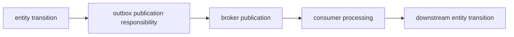

# Effects

Effects describe how semantic [[Effect|effects]] are placed, related, scoped, and carried through the system graph.

This note describes effect structure rather than redefining the semantic effect. An effect may be local to an [[Observer|observer]] or [[Entity|entity]] boundary, or it may cross a boundary through [[Interaction|interaction]]. A decision may declare an effect before any commit or external operation has occurred.

The system graph should distinguish:

```txt
effect declaration
  -> accepted decision
  -> committed local effect or obligation
  -> dispatch or physical attempt
  -> acknowledgment or typed result
  -> downstream interpretation and possible transition
```

Each stage has its own subject, identity, boundary, ordering, visibility, failure, and recovery meaning. A checkpoint, outbox record, broker acknowledgment, external response, and downstream transition may be causally related without being the same effect or occurrence.

## Effect and Emission Structure

Important structures include:

- A **transition effect** advances authoritative entity state when an accepted transition decision commits.
- A **domain-event emission** records or externalizes a fact without creating an emitter-side response obligation.
- A **request** creates a typed terminal-response or terminal-failure obligation and identifies where the result is consumed.
- A **signal** carries a one-way input toward a specified receiving participant or role without creating a response obligation.
- A **reply** discharges one admitted request.
- A **persistence effect** records reconstruction, audit, checkpoint, inbox, outbox, cursor, or ledger material without automatically becoming a domain event.
- An **infrastructure effect** changes a runtime or infrastructure subject through logging, allocation, cache mutation, offset advancement, scheduling, I/O, or similar activity.

A request is not an event subtype, and a domain event does not imply a response. The same broker, stream, API, workflow signal, actor message, or database record may carry different semantic roles only when the corresponding obligations and interpretations remain explicit.

An [[Interaction|implicit request protocol]] should therefore be represented as a request obligation plus a correlated terminal reply or failure path, not as a domain-event emission followed by an unnamed expectation. Asynchronous publication, routing, and reply delivery change the realization timing, not the effect role.

## Effect Identity and Provenance

Important effects should carry or derive stable identity, contract and payload revisions, originating definition and node, entity or process subject, correlation, causation, tenant or authority scope, idempotency basis, ordering scope, durability and visibility demands, and provenance.

Must, may, and actual effects are different structural projections. A conditional transition or process path may declare several possible emissions while one execution establishes only the effects on the selected path. Static summaries and execution traces should retain the branch and node provenance needed to explain that difference.

An effect handler is a realization adapter. Runtime registration does not make it semantic authority, and it must not mutate authoritative entity state directly. A result that changes entity state must return through an observer and transition boundary.

## Effect Scope and Boundaries

An effect scope is the modeled extent within which an effect has a particular status, meaning, ordering rule, visibility, and recovery obligation.

An effect boundary is the edge of that scope: the point where the effect becomes accepted, persisted, observed, published, acknowledged, committed, retried, compensated, or abandoned.

A single business operation can pass through several effect scopes and boundaries:


```mermaid
flowchart LR
  entity["entity transition"] --> outbox["outbox publication responsibility"]
  outbox --> broker["broker publication"]
  broker --> consumer["consumer processing"]
  consumer --> downstream["downstream entity transition"]
```

Each scope has a distinct meaning. The entity transition may be committed while publication remains pending. Broker publication may be acknowledged before any consumer transition occurs. Consumer processing may complete before downstream business completion is visible.

The scope names what can rely on the effect and under which rule. The boundary names where that rule starts, changes, or ends.

## Duplicate Effects

Effects that may be retried, replayed, resumed, or redelivered need [[Idempotency|idempotency]], deduplication, expected-version checks, or another rule that prevents duplicate domain effects.

For example, handling the same input twice may produce an applied no-change or prior-result outcome for the target entity while still recording an operational observation that the duplicate was seen. Publishing the same outbox record twice may be acceptable only when the receiver has an idempotent protocol, deduplication record, or [[Transactional Inbox|inbox]].

Related concepts: [[Effect|effect]], [[Event|event]], [[Command|command]], [[Query|query]], [[Messages and Envelopes|messages and envelopes]], [[Interaction Channels|interaction channels]], [[Correlation and Conversations|correlation and conversations]], [[Transition|transition]], [[Transition Models|transition models]], [[Process Graphs|process graphs]], [[Observer|observer]], [[Entity|entity]], [[Boundaries|boundaries]], [[Commit Boundaries|commit boundaries]], [[Acknowledgments|acknowledgments]], [[Interaction|interaction]], [[Delivery Semantics|delivery semantics]], [[Ordering|ordering]], [[Idempotency|idempotency]], [[Retry|retry]], [[Recovery|recovery]], [[Dual-Write Problem|dual-write problem]], [[Outbox|outbox]], [[Transactional Inbox|transactional inbox]], [[Event Sourcing|event sourcing]], [[Business Transactions|business transactions]], [[Execution Kernel|execution kernel]].
