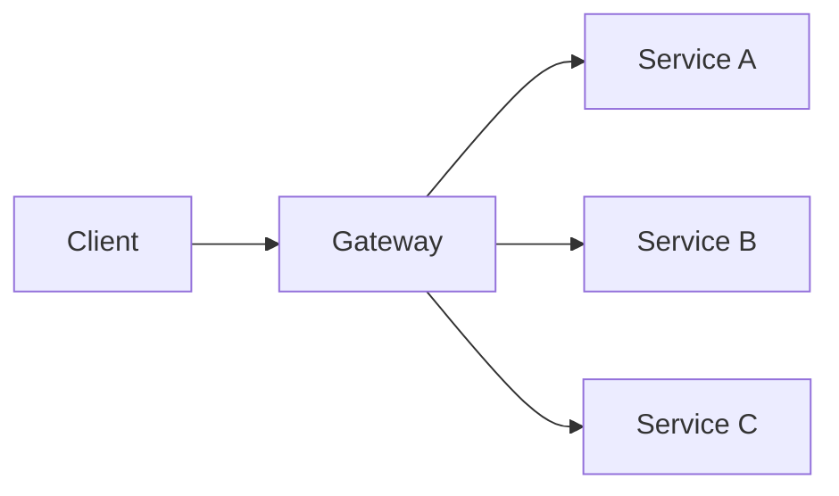

# Multiplexing and Demultiplexing

Multiplexing combines several distinguishable logical interaction flows onto a shared [[Interaction Channels|interaction channel]] or node. Demultiplexing uses an address, key, type, correlation identifier, or other discriminator to recover the intended logical flow or destination.

In compact form:

```text
multiplex:   (lane, value) -> shared flow
demultiplex: shared flow + discriminator -> lane
```

The two operations are dual but need not be colocated. A client, gateway, broker, transport connection, scheduler, or service implementation may perform either one.

## Layer-Relative Meaning

Multiplexing is relative to the layer being observed:

| Layer | Shared locus | Logical flows distinguished by |
| --- | --- | --- |
| Interface namespace | One service endpoint | operation, resource, or method |
| Service topology | One gateway or facade | downstream capability or service |
| Application protocol | One conversation channel | message type or correlation identifier |
| Broker | One topic, stream, or queue | key, subscription, or header |
| Transport | One connection | stream identifier or port |
| Runtime | One worker pool or scheduler | task, tenant, class, or priority |

A system may multiplex at one layer while demultiplexing at another.

## Distinctions

- [[Routing Models|Routing]] selects a next destination. Demultiplexing is the special case that recovers one logical lane or endpoint from a shared locus.
- [[Flow Operators|Splitting]] derives several output values from one input value. It does not necessarily recover pre-existing logical lanes.
- Aggregation combines several values into one composite value. It is semantic or structural composition, whereas multiplexing allows distinguishable flows to share capacity without necessarily combining their values.
- Fan-out copies or distributes an interaction to several destinations. It may follow demultiplexing but is not the same operation.

## Gateway Topologies

A gateway can demultiplex client requests across downstream services, multiplex several downstream capabilities behind one external node, or aggregate downstream results into one response.



From outside the boundary, the gateway is one interface provider. In the expanded [[Service Models|service model]], it may route, translate, aggregate, or coordinate several dependencies. Each additional role adds semantic, failure, and operational obligations.

## Operational Consequences

Shared loci couple flows through finite capacity. A complete model should therefore state:

- queue placement and bounds;
- fairness, priority, and admission policy;
- head-of-line blocking risks;
- isolation among tenants or traffic classes;
- failure and retry amplification;
- fan-out and tail-latency effects; and
- how backpressure propagates across the multiplexing boundary.

These properties connect multiplexing to [[Flow Control]], [[Queueing Theory]], and [[Scheduling]], as well as to reliability and performance analysis.

## External References

- [Enterprise Integration Patterns: Message Router](https://www.enterpriseintegrationpatterns.com/patterns/messaging/MessageRouter.html)
- [Enterprise Integration Patterns: Aggregator](https://www.enterpriseintegrationpatterns.com/patterns/messaging/Aggregator.html)
- [RFC 9113: HTTP/2](https://www.rfc-editor.org/rfc/rfc9113)
